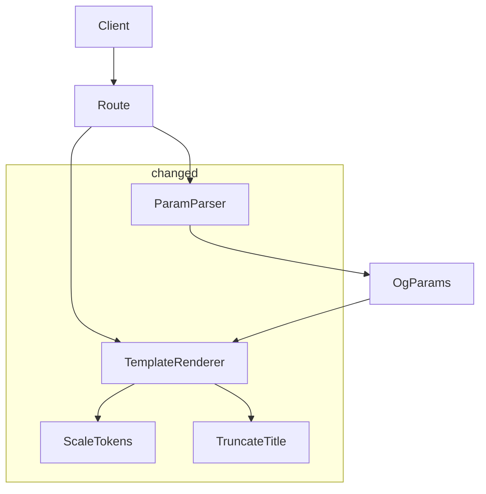
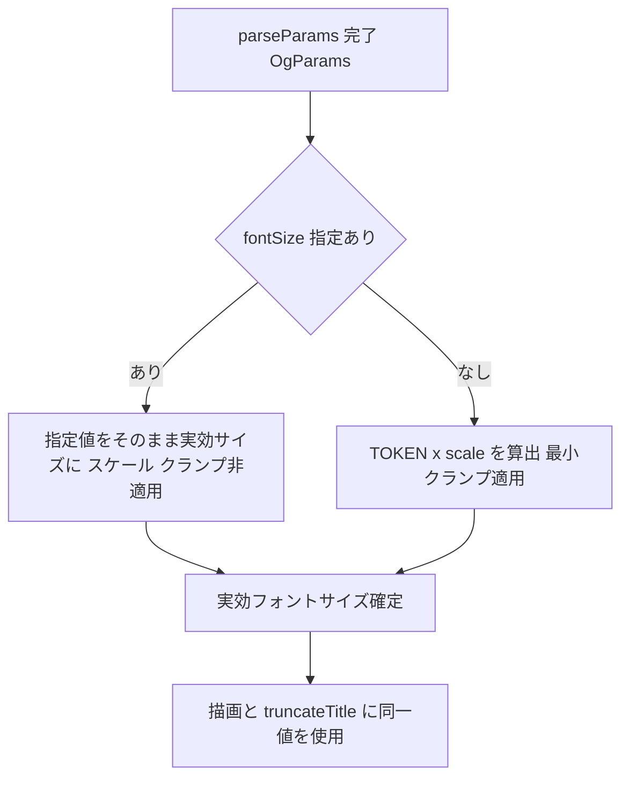

# Technical Design Document

## Overview

**Purpose**: 本機能は、OGP 画像の「タイトル」と「サイト名（ブログ名ラベル）」のフォントサイズを、URL クエリパラメータ `titleFontSize` / `siteFontSize` で個別に上書きする手段を、ブログ運営者に提供する。

**Users**: OGP 画像を埋め込むブログ運営者が、`GET /api/og?title=...&titleFontSize=72&siteFontSize=24` のように記事ごとに見栄えを微調整する用途で利用する。

**Impact**: 現状、フォントサイズは `lib/template.tsx` のデザイントークン（`TITLE_FONT_SIZE`=56px / `LABEL_FONT_SIZE`=28px）に固定され、画像短辺基準のスケール係数でのみ調整される。本機能は、パラメータ指定時にこのスケーリング・クランプを迂回し、指定値を実効フォントサイズ（絶対 px）として採用する分岐を追加する。変更は `lib/params.ts`（解析・検証）と `lib/template.tsx`（条件付きスケーリング）の 2 モジュールに閉じ、`app/api/og/route.ts` は無変更。

### Goals
- `titleFontSize` / `siteFontSize` を正の整数のオプショナルクエリパラメータとして解析・検証する。
- パラメータ指定時はスケール・クランプを適用せず指定値をそのまま使用し、省略時は既存挙動（トークン × scale、最小クランプ）を維持する。
- タイトルの折り返し・省略計算（`truncateTitle`）に、描画と同一の実効フォントサイズを使用する。

### Non-Goals
- 色トークン（背景色・文字色）のランタイム上書き（steering 方針により対象外）。
- フォントサイズの上限値設定（既存寸法パラメータと同様に上限なし）。
- フォントウェイト・行間・フォントファミリ等、フォントサイズ以外のタイポグラフィ制御。

## Architecture

### Existing Architecture Analysis

レイヤード構成。`app/api/og/route.ts` が `config → params → fonts → template → render` の順で `lib/` 各純粋関数モジュールをオーケストレーションする。本機能が触れる境界は以下のとおり。

- **`lib/params.ts`（ParamParser）**: `URLSearchParams` → `OgParams | ValidationError` の純粋変換。fail-fast 検証、`isPositiveInteger` ヘルパー、`ValidationError` ユニオン型を保持。
- **`lib/template.tsx`（TemplateRenderer）**: `OgParams` + `AppConfig` → `ReactElement`。`_calcScaleFactor` と `_scaleTokens` でデザイントークンを短辺基準にスケール・クランプし、`truncateTitle` に実効サイズを渡す。
- **維持すべき制約**: 各モジュールの参照透過性、`OgParams` を介した route との疎結合、`_` プレフィックスのテスト公開関数規約。

### Architecture Pattern & Boundary Map



**Architecture Integration**:
- Selected pattern: 既存のレイヤード純粋関数パイプラインを踏襲。新規境界は導入しない（研究ログ案 A 採用）。
- Domain/feature boundaries: 解析・検証は ParamParser、サイズ確定・描画は TemplateRenderer に閉じる。route は無変更。
- Existing patterns preserved: `?? default` フォールバック、fail-fast 検証、`ValidationError` ユニオン、`_scaleTokens` の純粋関数性。
- New components rationale: 新コンポーネントなし。`OgParams` に 2 オプショナルフィールド、`ValidationError` に 1 エラーコード、`_scaleTokens` にオーバーライド引数を追加するのみ。
- Steering compliance: `tech.md` 更新済み方針（フォントサイズはクエリ上書き可・色は不可）に整合。

### Technology Stack

| Layer | Choice / Version | Role in Feature | Notes |
|-------|------------------|-----------------|-------|
| Backend / Services | TypeScript (strict) + Next.js 16 App Router | `lib/params.ts` 解析・検証、`lib/template.tsx` サイズ確定 | 既存スタックのみ。新規依存なし |
| Image Generation | satori | 確定フォントサイズで JSX → SVG 描画 | 大フォントでも描画自体は破綻しない |
| Testing | Vitest 4 | 解析・スケーリング分岐の回帰 | 既存スナップショットへの影響に留意 |

## Requirements Traceability

| Requirement | Summary | Components | Interfaces | Flows |
|-------------|---------|------------|------------|-------|
| 1.1 | `titleFontSize` 正の整数を採用 | ParamParser | `parseParams` | 解析フロー |
| 1.2 | 省略時は `TITLE_FONT_SIZE` を基準値に | ParamParser, TemplateRenderer | `parseParams`, `_scaleTokens` | スケーリング分岐 |
| 1.3 | タイトルのみに適用 | TemplateRenderer | `_scaleTokens` | スケーリング分岐 |
| 2.1 | `siteFontSize` 正の整数を採用 | ParamParser | `parseParams` | 解析フロー |
| 2.2 | 省略時は `LABEL_FONT_SIZE` を基準値に | ParamParser, TemplateRenderer | `parseParams`, `_scaleTokens` | スケーリング分岐 |
| 2.3 | サイト名ラベルのみに適用 | TemplateRenderer | `_scaleTokens` | スケーリング分岐 |
| 3.1 | 正の整数以外はエラー・生成中止 | ParamParser | `parseParams` | 解析フロー |
| 3.2 | 構造化エラー（code/field/message）を返す | ParamParser | `ValidationError` | 解析フロー |
| 3.3 | 既存と同じ fail-fast・正整数規則 | ParamParser | `isPositiveInteger` | 解析フロー |
| 4.1 | `titleFontSize` 指定時はスケール・クランプ非適用 | TemplateRenderer | `_scaleTokens` | スケーリング分岐 |
| 4.2 | `titleFontSize` 省略時は `TITLE_FONT_SIZE` × scale, 16px 下限 | TemplateRenderer | `_scaleTokens` | スケーリング分岐 |
| 4.3 | `siteFontSize` 指定時はスケール・クランプ非適用 | TemplateRenderer | `_scaleTokens` | スケーリング分岐 |
| 4.4 | `siteFontSize` 省略時は `LABEL_FONT_SIZE` × scale, 12px 下限 | TemplateRenderer | `_scaleTokens` | スケーリング分岐 |
| 4.5 | `truncateTitle` に描画と同一の実効サイズを使用 | TemplateRenderer | `renderTemplate`, `truncateTitle` | スケーリング分岐 |

## System Flows

### スケーリング分岐フロー（タイトル／ラベル共通の判別ロジック）



タイトルは `titleFontSize` と `TITLE_FONT_SIZE`/16px 下限、ラベルは `siteFontSize` と `LABEL_FONT_SIZE`/12px 下限で、それぞれ独立に同じ判別を行う。指定/省略は各パラメータ単位で評価するため、片方のみ指定（例: タイトルは絶対値・ラベルはスケール）も成立する。

## Components and Interfaces

| Component | Domain/Layer | Intent | Req Coverage | Key Dependencies (P0/P1) | Contracts |
|-----------|--------------|--------|--------------|--------------------------|-----------|
| ParamParser (`lib/params.ts`) | Domain Logic | クエリから `titleFontSize`/`siteFontSize` を解析・検証 | 1.1, 1.2, 2.1, 2.2, 3.1, 3.2, 3.3 | URLSearchParams (P0) | Service, State |
| TemplateRenderer (`lib/template.tsx`) | Domain Logic | 指定/省略に応じた実効フォントサイズの確定と描画 | 1.2, 1.3, 2.2, 2.3, 4.1–4.5 | OgParams (P0) | Service |

### Domain Logic

#### ParamParser (`lib/params.ts`)

| Field | Detail |
|-------|--------|
| Intent | `titleFontSize` / `siteFontSize` を正の整数として解析・検証し `OgParams` に格納する |
| Requirements | 1.1, 1.2, 2.1, 2.2, 3.1, 3.2, 3.3 |

**Responsibilities & Constraints**
- 両パラメータを既存パターン（fail-fast、`isPositiveInteger`、空文字/未指定はデフォルト扱い）で解析する。
- 未指定は `undefined` として保持し、スケーリング適用可否の判別子をテンプレートに伝える（解析層では既定トークン値を埋めない）。
- 検証失敗時は `INVALID_FONT_SIZE` の `ValidationError` を fail-fast で返す。
- 仕様外パラメータは引き続き無視する（既存挙動）。

**Dependencies**
- Inbound: `app/api/og/route.ts` — `searchParams` を渡す（P0）
- Outbound: なし（純粋関数）

**Contracts**: Service [x] / API [ ] / Event [ ] / Batch [ ] / State [x]

##### Service Interface

```typescript
/** 解析・検証済みのパラメータ（拡張後） */
interface OgParams {
  title: string;
  width: number;
  height: number;
  textWidth: number;
  format: "png" | "svg";
  /** タイトルフォントサイズ（px）。未指定時は undefined（テンプレートでスケール適用） */
  titleFontSize?: number;
  /** サイト名ラベルフォントサイズ（px）。未指定時は undefined（テンプレートでスケール適用） */
  siteFontSize?: number;
}

/** バリデーションエラーコード（拡張後） */
type ValidationErrorCode =
  | "INVALID_FORMAT"
  | "INVALID_DIMENSION"
  | "TITLE_TOO_LONG"
  | "INVALID_FONT_SIZE";

// parseParams のシグネチャは不変（戻り値の OgParams のみ拡張）
function parseParams(
  searchParams: URLSearchParams,
  defaults: ParamDefaults
): ParseResult;
```

- Preconditions: `searchParams` は URLSearchParams。
- Postconditions: `ok: true` 時、`titleFontSize`/`siteFontSize` は正の整数または `undefined`。`ok: false` 時、最初に失敗したフィールドの `ValidationError` を返す。
- Invariants: 同一入力に対し同一出力（参照透過）。未指定パラメータは `undefined` で表現され、既定値の埋め込みは行わない。

##### State Management
- State model: 状態を持たない純粋関数。`OgParams` は不変の値オブジェクト。
- Persistence & consistency: なし。
- Concurrency strategy: 共有状態なし。

**Implementation Notes**
- Integration: `route.ts` は `parseParams` の戻り値を `renderTemplate` に透過的に渡すのみで変更不要。
- Validation: `width`/`height`/`textWidth` と同一の `isPositiveInteger` を再利用。0・負数・小数・非数値文字列を排除。検証順序は fail-fast のため `titleFontSize` → `siteFontSize` の順で評価し、最初のエラーを返す。
- Risks: 指定時クランプを外すため極小値（例: 1px）も通過するが、正整数制約で最低限の健全性を担保。

#### TemplateRenderer (`lib/template.tsx`)

| Field | Detail |
|-------|--------|
| Intent | 指定/省略に応じてタイトル・ラベルの実効フォントサイズを確定し描画する |
| Requirements | 1.2, 1.3, 2.2, 2.3, 4.1, 4.2, 4.3, 4.4, 4.5 |

**Responsibilities & Constraints**
- `_scaleTokens` に「フォントサイズオーバーライド」を渡し、指定値があればスケール・クランプを迂回して採用、なければ既存式（`TOKEN × scale`、最小クランプ）を適用する。
- `siteFontSize`（クエリ語彙）を内部の label スロット（`LABEL_FONT_SIZE` 相当）へマッピングする。
- 確定した `tokens.titleFontSize` を描画と `truncateTitle` の双方に渡し、折り返し計算と描画を一致させる。

**Dependencies**
- Inbound: `app/api/og/route.ts` — `renderTemplate({ params, config })`（P0）
- Outbound: satori（描画。`renderTemplate` の呼び出し側で実施）

**Contracts**: Service [x] / API [ ] / Event [ ] / Batch [ ] / State [ ]

##### Service Interface

```typescript
/** フォントサイズのオーバーライド（クエリ指定値）。未指定フィールドは既存スケーリングを適用 */
interface FontSizeOverrides {
  /** タイトル指定値（px）。undefined なら TITLE_FONT_SIZE × scale + 16px クランプ */
  title?: number;
  /** ラベル指定値（px）。undefined なら LABEL_FONT_SIZE × scale + 12px クランプ */
  label?: number;
}

// 第 4 引数をオプショナル追加（後方の呼び出しは省略可、省略時は現行挙動）
export function _scaleTokens(
  scale: number,
  width: number,
  height: number,
  fontSizeOverrides?: FontSizeOverrides
): ScaledTokens;

// renderTemplate のシグネチャは不変（内部で params.titleFontSize/siteFontSize を読み取る）
export function renderTemplate(input: RenderInput): React.ReactElement;
```

- Preconditions: `fontSizeOverrides.title`/`label` は正の整数または `undefined`（ParamParser で保証済み）。
- Postconditions:
  - `title` 指定時: `titleFontSize = title`（スケール・クランプ非適用）。未指定時: `titleFontSize = max(16, TITLE_FONT_SIZE × scale)`。
  - `label` 指定時: `labelFontSize = label`（スケール・クランプ非適用）。未指定時: `labelFontSize = max(12, LABEL_FONT_SIZE × scale)`。
  - `truncateTitle` は上記で確定した `titleFontSize` を受け取る。
- Invariants: 同一入力に対し同一出力（参照透過）。`fontSizeOverrides` 省略時は変更前と完全に同一の `ScaledTokens` を返す。

**Implementation Notes**
- Integration: `renderTemplate` 内で `_scaleTokens(scale, width, height, { title: params.titleFontSize, label: params.siteFontSize })` を呼ぶ。`padding`/`accentLine*` は従来どおりスケーリング（フォントサイズのみ条件分岐）。
- Validation: 値の妥当性は ParamParser が担保。テンプレートは型（`number | undefined`）のみ前提とする。
- **境界ガード（`truncateTitle`）**: `truncateTitle` は `charsPerLine = Math.floor(textWidth / fontSize)` を算出するため、`titleFontSize > effectiveTextWidth`（デフォルト textWidth=960 では 961px 以上）の指定で `charsPerLine = 0` → `maxChars = 0` となり、`title.slice(0, maxChars - 1)`（= `slice(0, -1)`）が末尾 1 文字を欠落させた異常出力を返す。上限なし方針によりこの境界は利用者入力で到達可能となるため、実装時に `charsPerLine` を `Math.max(1, …)` でクランプする、または `maxChars <= 0` を早期 return で扱う。
- Risks: 既存スナップショットテストは「パラメータ未指定」で生成されているため、`fontSizeOverrides` 省略時に同一出力となることを担保すれば回帰しない。新規スナップショットは指定ケース用に追加する。

## Data Models

### Logical Data Model

`OgParams`（値オブジェクト）に 2 つのオプショナル数値フィールドを追加する。

| Field | Type | 必須 | 意味 | 未指定時 |
|-------|------|------|------|----------|
| `titleFontSize` | `number \| undefined` | 任意 | タイトルの実効フォントサイズ（px） | `undefined`（`TITLE_FONT_SIZE` をスケール） |
| `siteFontSize` | `number \| undefined` | 任意 | サイト名ラベルの実効フォントサイズ（px） | `undefined`（`LABEL_FONT_SIZE` をスケール） |

### Data Contracts & Integration

**API Data Transfer（クエリパラメータ）**

| Param | 型/規則 | 必須 | 例 | 不正時 |
|-------|---------|------|-----|--------|
| `titleFontSize` | 正の整数（文字列）。空文字・省略可 | 任意 | `titleFontSize=72` | `INVALID_FONT_SIZE` / 400 |
| `siteFontSize` | 正の整数（文字列）。空文字・省略可 | 任意 | `siteFontSize=24` | `INVALID_FONT_SIZE` / 400 |

エラーレスポンスは既存と同形式（`route.ts` が `{ error, field }` を 400 JSON で返却）。

## Error Handling

### Error Strategy
ParamParser で fail-fast 検証し、最初の不正フィールドで `ValidationError` を返す。`route.ts` は既存どおり `ok: false` を 400 JSON（`{ error: message, field }`）に変換する。新規の例外経路・try/catch は追加しない。

### Error Categories and Responses
- **User Errors (400)**: `titleFontSize`/`siteFontSize` が正の整数でない → `INVALID_FONT_SIZE`、`field` に該当パラメータ名、`message` に「正の整数で指定してください（受け取った値: "…"）」相当の人間可読メッセージ。
- **System Errors (5xx)**: 本機能では新規発生なし（描画は既存経路）。

### Monitoring
既存の `console.error("[RequestHandler] …")` 経路を流用。新規ログは追加しない。

## Testing Strategy

### Unit Tests（`tests/params.test.ts`）
- `titleFontSize=72` / `siteFontSize=24` が正の整数として `OgParams` に格納される。
- `titleFontSize` 省略時に `titleFontSize === undefined`（`siteFontSize` も同様）。
- `titleFontSize=0` / `-1` / `12.5` / `abc` で `INVALID_FONT_SIZE` を fail-fast で返し、`field` が一致する。
- 既存パラメータと併用した際に検証順序（fail-fast）が破綻しない。

### Unit Tests（`tests/template.test.tsx`）
- `_scaleTokens(scale, w, h, { title: 72 })` が `titleFontSize === 72`（スケール・クランプ非適用）を返す。
- `_scaleTokens(scale, w, h, { label: 10 })` が `labelFontSize === 10`（12px クランプを迂回）を返す。
- `_scaleTokens(scale, w, h)`（オーバーライド省略）が変更前と同一の `ScaledTokens` を返す（回帰防止）。
- `renderTemplate` が `titleFontSize` 指定時、`truncateTitle` に同一実効サイズを渡す（Req 4.5）。
- **境界**: `titleFontSize > effectiveTextWidth`（例: textWidth=960 で `titleFontSize=1000`）の指定で `truncateTitle` が末尾欠落やクラッシュを起こさず、健全な出力（全文または「…」付き省略）を返す。

### Snapshot Tests（`tests/__snapshots__/`）
- 既存スナップショット（未指定ケース）が不変であることを確認。
- `titleFontSize`/`siteFontSize` 指定ケースのスナップショットを新規追加。

## Supporting References
- 詳細な調査ログ・代替案比較・意思決定の根拠は `research.md` を参照。
