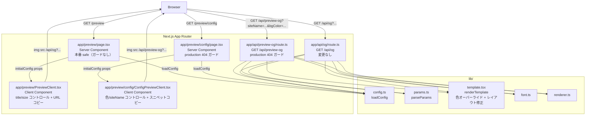
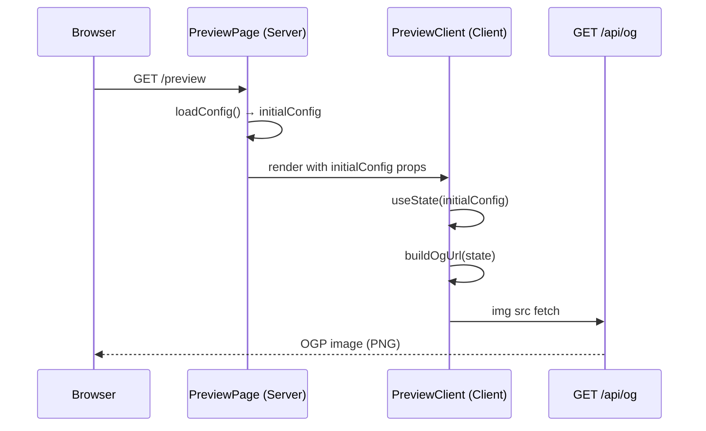
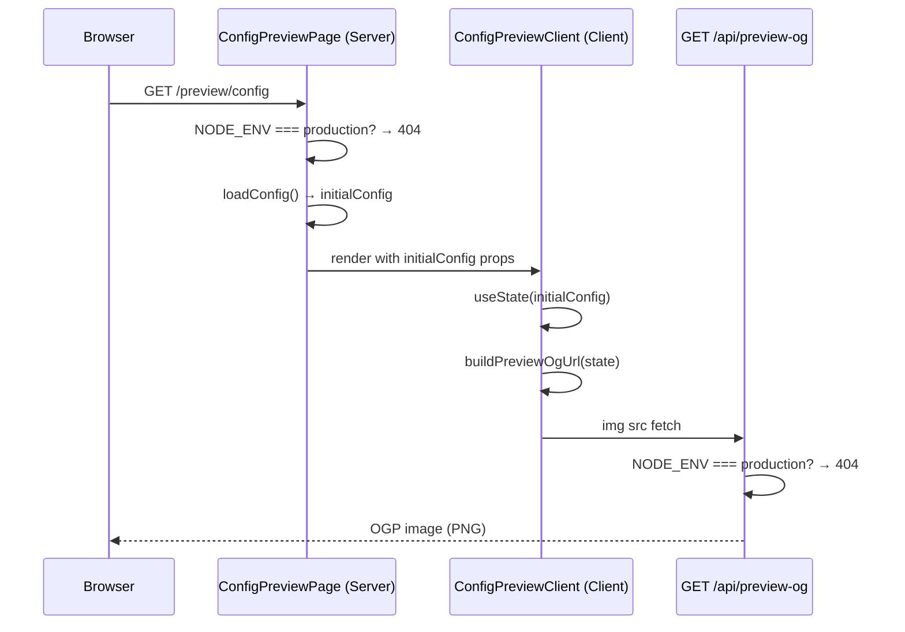
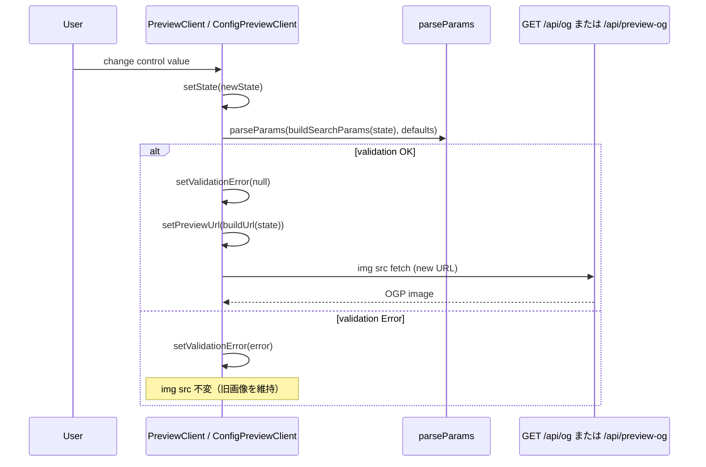
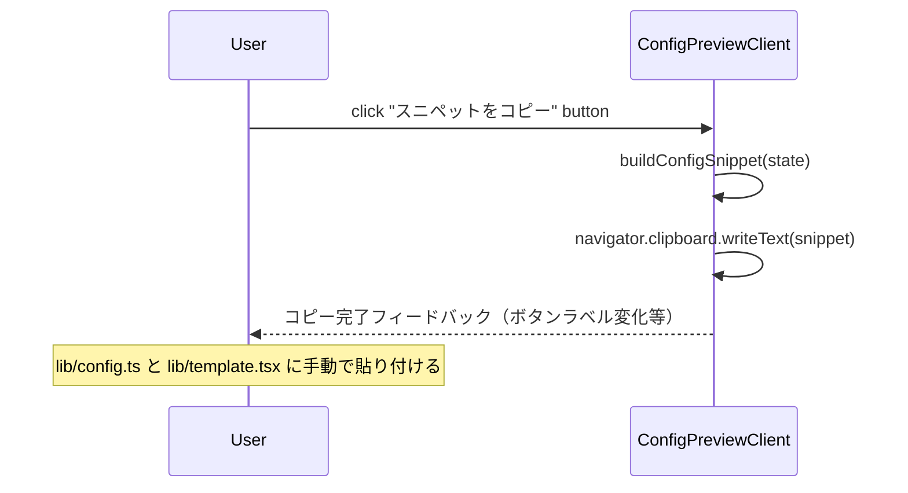

# 技術設計書: local-preview-layout-config

## Overview

本フィーチャーは、OGP 画像の開発効率向上を目的として 2 つの独立した価値を提供する。

1. **2 つのプレビューツール**:
   - `/preview` — 本番環境にも存在する production-safe ページ。タイトル・サイズパラメータをインタラクティブに変更し、`/api/og` URL をクリックでコピーできる。
   - `/preview/config` — ローカル開発専用ページ（production で 404）。デザイントークン（色・サイト名・テキスト幅比率）を試し、`lib/config.ts` / `lib/template.tsx` への反映スクリプトをコピーできる。
2. **テンプレートレイアウト修正**: `textWidth` に基づいてタイトルテキストエリアを水平方向に中央寄せし、フッター（ブログ名）の左端をタイトルコンテナの左端に揃える修正を実装する。

**ユーザー**: 本サービスを運用する開発者（ブログオーナー）。

**Impact**: プレビュー専用 API エンドポイント `app/api/preview-og/`、`/preview` ページ、`/preview/config` ページを新規追加する。`lib/template.tsx` にレイアウト計算修正と色オーバーライド対応を追加する。本番用 `/api/og` は無変更。

### Goals

- `/preview` で URL コピー機能付きの本番 safe OGP プレビューを提供する
- `/preview/config` でデザイントークンをインタラクティブに試し、git 管理ソースファイルへの変更スクリプトをコピーできる
- `textWidth` に基づいてタイトルを水平中央寄せし、フッターの左端をタイトルコンテナの左端と揃える
- プレビュー用拡張パラメータを本番エンドポイントと完全に分離し、production 環境での露出を防止する

### Non-Goals

- デザイントークンの自動永続化（変更適用には `lib/config.ts` / `lib/template.tsx` の手動編集が必要）
- `/api/og`（本番エンドポイント）への `siteName` / 色パラメータの追加（本フィーチャーでは変更しない）
- `format` パラメータのプレビュー UI 制御（PNG 固定で十分）
- 環境変数（`.env.local`）の自動生成・更新

---

## Architecture

### Existing Architecture Analysis

既存システムは以下のレイヤード構成を持つ:

- `lib/` — 純粋関数モジュール群（`config`, `params`, `font`, `template`, `renderer`）
- `app/api/og/route.ts` — Node.js Runtime エントリポイント、`lib/` モジュールをオーケストレーション
- `app/layout.tsx` — ルートレイアウト（最小構成）
- フロントエンドページは現状ゼロ

制約:
- `loadConfig()` は `process.env` 依存のためサーバー専用
- satori は `calc()` 非対応のためレイアウト計算は JS で事前に行う必要がある
- `lib/params.ts` の `parseParams` は純粋関数で Client Component からインポート可能
- `lib/config.ts` の `??` フォールバック値および `lib/template.tsx` の色定数はリポジトリに git 管理されており、フォーク時のカスタマイズポイントとなっている

### Architecture Pattern & Boundary Map



**Key Decisions**:
- **`/preview` を本番 safe に設計**: `/preview` は production ガードを持たず、本番環境でも動作する。コントロールは `title`, `width`, `height`, `textWidth` のみで、本番 `/api/og` に対してそのままリクエストを発行する。画像クリックで `/api/og?...` URL をクリップボードにコピーする（要件 1.4 の production 404 ガードは `/preview/config` と `/api/preview-og` にのみ適用される）。
- **`/preview/config` を dev 専用に分離**: `siteName`, `backgroundColor`, `textColor`, `accentColor`, `defaultTextWidthRatio`, `BASE_SHORT_SIDE` の変更は `/preview/config` でのみ提供する。`NODE_ENV=production` で 404 を返し、production デプロイ後の外部露出リスクがない。
- **コピースニペットで git 管理ファイルを対象**: `.env.local` は git 管理外のため再現性がない。スニペットは `lib/config.ts` のデフォルト値変更箇所と `lib/template.tsx` の定数変更箇所をテキストで提示し、開発者が手動で貼り付ける形式とする。
- **プレビュー専用エンドポイント分離**: 色・サイト名のオーバーライドパラメータを受け付ける `/api/preview-og` を新設し、`NODE_ENV=production` で 404 を返す。本番 `/api/og` は完全無変更のため、拡張パラメータが本番環境に露出するリスクがない。
- **Server Component + Client Component 分割**: Server Component がサーバー専用 `loadConfig()` を担当し初期値を props で渡す。Client Component は `useState` でコントロール値を管理し `` を動的更新する（フルリロードなし）。
- **`parseParams` の再利用**: 純粋関数のため Client Component からも直接インポートしてバリデーションに使用する。バリデーション重複実装不要。
- **`renderTemplate` に色オーバーライド追加**: `RenderInput` に optional `ColorOverrides` を追加し、未指定時は既存定数にフォールバックする。`/api/og` の既存呼び出しコードは変更不要。

### Technology Stack

| Layer | Choice / Version | Role in Feature | Notes |
|-------|------------------|-----------------|-------|
| Frontend | Next.js 16+ App Router / React 19 | `/preview`, `/preview/config` ページ（Server + Client Component） | 既存スタックを踏襲 |
| State Management | React `useState` | プレビューコントロール値のエフェメラル管理 | 外部ライブラリ不要 |
| Validation | `lib/params.ts` `parseParams` | Client Component 内バリデーション | 既存純粋関数を再利用 |
| Image Generation | satori + @resvg/resvg-wasm | テンプレートレイアウト修正・色オーバーライドの反映先 | 既存スタック、変更は `lib/template.tsx` のみ |
| Runtime | Node.js Runtime | `/api/preview-og` も Node.js Runtime で動作 | 既存スタック |

---

## System Flows

### `/preview` 初期化フロー



### `/preview/config` 初期化フロー



### インタラクティブ更新フロー（コントロール変更・共通）



### スニペットコピーフロー（`/preview/config` のみ）



---

## Requirements Traceability

| 要件 | 概要 | コンポーネント | インターフェース | フロー |
|------|------|--------------|----------------|--------|
| 1.1 | `/preview` ルートで OGP 画像をブラウザ表示 | PreviewPage, PreviewClient | `PreviewClientProps` | /preview 初期化フロー |
| 1.2 | デフォルト設定で画像を表示 | PreviewClient | `buildOgUrl` | /preview 初期化フロー |
| 1.3 | URL クエリパラメータで初期値を上書き | PreviewPage | Next.js `searchParams` | /preview 初期化フロー |
| 1.4 | production 時 404 | ConfigPreviewPage, PreviewOgRoute | `notFound()` | /preview/config 初期化フロー |
| 2.1 | コントロール UI（title, width, height, textWidth, siteName, defaultTextWidthRatio） | PreviewClient（title/size）, ConfigPreviewClient（siteName/ratio/色） | `PreviewState`, `ConfigPreviewState` | インタラクティブ更新フロー |
| 2.2 | コントロール変更でフルリロードなし再レンダリング | PreviewClient, ConfigPreviewClient | `setPreviewUrl`, `` | インタラクティブ更新フロー |
| 2.3 | 初期値を env / config.ts から取得 | PreviewPage → PreviewClient, ConfigPreviewPage → ConfigPreviewClient | `initialConfig` props | 初期化フロー |
| 2.4 | 無効値のバリデーションエラー表示 | PreviewClient, ConfigPreviewClient | `parseParams`, `ValidationError` | インタラクティブ更新フロー |
| 2.5 | 変更値をディスク・env に永続化しない | PreviewClient, ConfigPreviewClient | `useState`（エフェメラル） | — |
| 3.1 | タイトルコンテナの左右マージン均等 | OgTemplate | `innerMarginLeft` 計算 | — |
| 3.2 | `textWidth == width` 時にマージン 0 | OgTemplate | `innerMarginLeft` 計算 | — |
| 3.3 | `textWidth > width` 時にクランプ | OgTemplate | `effectiveTextWidth` | — |
| 3.4 | 固定左オフセット非使用 | OgTemplate | `innerMarginLeft` 一元管理 | — |
| 4.1 | フッター左端をタイトルコンテナ左端に揃える | OgTemplate | タイトルと同一 `innerMarginLeft` をフッターに適用 | — |
| 4.2 | `textWidth < width` 時に同一オフセット適用 | OgTemplate | `innerMarginLeft` 共有 | — |
| 4.3 | `textWidth == width` 時フッターは追加オフセット 0 | OgTemplate | `innerMarginLeft` 計算（= 0） | — |
| 4.4 | フッターの独立固定マージン非使用 | OgTemplate | `innerMarginLeft` 一元管理 | — |
| 5.1 | フォントサイズを `min(width, height) / BASE_SHORT_SIDE` でスケーリング | OgTemplate | `_calcScaleFactor(baseShortSide)` / `_scaleTokens`（`baseShortSide` 引数追加） | — |
| 5.2 | width/height 変更でフォントサイズ即時反映 | PreviewClient | img src 動的更新 | インタラクティブ更新フロー |
| 5.3 | `TITLE_FONT_SIZE`, `LABEL_FONT_SIZE`, `BASE_SHORT_SIDE` を先頭定数で管理 | OgTemplate | ファイル先頭定数（`BASE_SHORT_SIDE` を明示的定数として追加） | — |
| 5.4 | `/preview/config` に `BASE_SHORT_SIDE` コントロール | ConfigPreviewClient | `ConfigPreviewState.baseShortSide` → `/api/preview-og?baseShortSide=` | インタラクティブ更新フロー |

---

## Components and Interfaces

### コンポーネント概要

| Component | Domain / Layer | Intent | Req Coverage | Key Dependencies | Contracts |
|-----------|---------------|--------|--------------|------------------|-----------|
| PreviewPage | App / Server | 初期値取得 + Client へ渡し（production ガードなし） | 1.1, 1.3, 2.3 | `loadConfig` (P0), `PreviewClient` (P0) | State |
| PreviewClient | App / Client | title/size コントロール + URL コピー | 1.1, 1.2, 1.3, 2.1（基本パラメータ）, 2.2–2.5, 5.2 | `parseParams` (P0) | State, API |
| ConfigPreviewPage | App / Server | production 404 ガード + 初期値取得 + ConfigPreviewClient へ渡し | 1.4, 2.3 | `loadConfig` (P0), `ConfigPreviewClient` (P0) | State |
| ConfigPreviewClient | App / Client | config コントロール + スニペットコピー | 2.1（設定パラメータ）, 2.2–2.5 | `parseParams` (P0) | State, API |
| PreviewOgRoute | API / Preview | production 404 ガード + 全オーバーライドパラメータ対応 | 1.4（API 側）, 2.1（siteName + 色） | `loadConfig` (P0), `parseParams` (P0), `renderTemplate` (P0) | API |
| OgTemplate | Lib | 色オーバーライド対応 + 中央寄せレイアウト計算 | 3.1–3.4, 4.1–4.4, 5.1, 5.3 | なし（純粋関数） | Service |

---

### App / Server

#### PreviewPage

| Field | Detail |
|-------|--------|
| Intent | `loadConfig()` で初期値を取得し `PreviewClient` に渡す（production ガードなし） |
| Requirements | 1.1, 1.3, 2.3 |

**Responsibilities & Constraints**
- production ガードを持たない（`/preview` は本番環境でも動作する）
- `loadConfig()` は Server Component 内でのみ呼び出す（`process.env` 依存）
- URL `searchParams` からの初期値オーバーライドを受け付け `PreviewClient` に渡す
- クライアントサイドのレンダリングロジックや状態管理を持たない

**Dependencies**
- Outbound: `loadConfig` — AppConfig 取得 (P0)
- Outbound: `PreviewClient` — 初期値 props 渡し (P0)

**Contracts**: State [ ✓ ]

##### State Management

```typescript
/** PreviewPage が受け付ける Next.js searchParams の型 */
type PreviewPageSearchParams = {
  title?: string;
  width?: string;
  height?: string;
  textWidth?: string;
};
```

Server Component のため状態なし。`loadConfig()` の戻り値を `PreviewClientProps.initialConfig` にマッピングして渡す。URL `searchParams` の値は型変換のみ行い、バリデーションは PreviewClient が担当。

**Implementation Notes**
- Risks: テスト時に `.env.local` が未存在の場合、`loadConfig()` は `lib/config.ts` のフォールバックデフォルト値を返す（仕様通り）。

---

#### ConfigPreviewPage

| Field | Detail |
|-------|--------|
| Intent | production 404 ガード後、`loadConfig()` で初期値を取得し `ConfigPreviewClient` に渡す |
| Requirements | 1.4, 2.3 |

**Responsibilities & Constraints**
- `NODE_ENV === "production"` の場合 `notFound()` を呼び出し 404 を返す
- `loadConfig()` は Server Component 内でのみ呼び出す（`process.env` 依存）
- クライアントサイドのレンダリングロジックや状態管理を持たない

**Dependencies**
- Outbound: `loadConfig` — AppConfig 取得 (P0)
- Outbound: `ConfigPreviewClient` — 初期値 props 渡し (P0)
- External: `next/navigation notFound` — 404 レスポンス (P0)

**Contracts**: State [ ✓ ]

##### State Management

Server Component のため状態なし。`loadConfig()` の戻り値を `ConfigPreviewClientProps.initialConfig` にマッピングして渡す。

**Implementation Notes**
- Integration: `import { notFound } from "next/navigation"` / `process.env.NODE_ENV` はビルド時解決。

---

### App / Client

#### PreviewClient

| Field | Detail |
|-------|--------|
| Intent | title/size コントロールでパラメータを管理し、バリデーション後に `/api/og` URL を動的更新する。画像クリックで URL をクリップボードにコピーする。 |
| Requirements | 1.1, 1.2, 1.3, 2.1（基本パラメータ）, 2.2–2.5, 5.2 |

**Responsibilities & Constraints**
- `"use client"` ディレクティブを持つ Client Component
- すべてのコントロール値をエフェメラルな `useState` で管理する（永続化なし）
- コントロール変更のたびに `parseParams` でバリデーションし、エラーがなければ `` を更新する
- `defaultTextWidthRatio` 変更時および `width` 変更時に `textWidth` を自動再計算する（`textWidth = floor(width * defaultTextWidthRatio)`）
- 表示している OGP 画像をクリックすると `/api/og?...` の URL をクリップボードにコピーする
- **`/api/og` を使用する**（`/api/preview-og` ではない）
- 色・サイト名のコントロールを持たない

**Dependencies**
- Inbound: `PreviewPage` — `PreviewClientProps`（initialConfig）(P0)
- Outbound: `GET /api/og` — OGP 画像取得（img src として）(P0)
- External: `parseParams` from `@/lib/params` — バリデーション (P0)

**Contracts**: State [ ✓ ] / API [ ✓ ]

##### State Management

```typescript
/** PreviewClient の内部状態 */
interface PreviewState {
  title: string;
  width: number;
  height: number;
  textWidth: number;
  defaultTextWidthRatio: number;
}

/** PreviewPage から受け取る初期値 props */
interface PreviewClientProps {
  initialConfig: PreviewState;
}
```

**State Invariants**:
- `width` および `height` は常に正の整数（`parseParams` でバリデーション済み）
- `textWidth` は常に正の整数
- `validationError` が非 null のとき `` を更新しない（旧画像を維持）

##### API Contract

| Method | Endpoint | Request | Response | Errors |
|--------|----------|---------|----------|--------|
| GET | /api/og | `title`, `width`, `height`, `textWidth` | PNG 画像 | 400, 500 |

**Implementation Notes**
- Integration: `parseParams` は `URLSearchParams` を受け取る。state から `new URLSearchParams({...})` を構築し渡す。
- URL Copy: OGP 画像要素に `onClick` ハンドラを設置し `navigator.clipboard.writeText(currentOgUrl)` を実行する。

---

#### ConfigPreviewClient

| Field | Detail |
|-------|--------|
| Intent | config コントロール（色・siteName・defaultTextWidthRatio）でパラメータを管理し、`/api/preview-og` URL を動的更新する。「スニペットをコピー」ボタンで git 管理ファイルへの変更スクリプトを生成する。 |
| Requirements | 2.1（設定パラメータ）, 2.2–2.5 |

**Responsibilities & Constraints**
- `"use client"` ディレクティブを持つ Client Component
- すべてのコントロール値をエフェメラルな `useState` で管理する（永続化なし）
- コントロール変更のたびに `/api/preview-og?...` img src を更新する
- 「スニペットをコピー」ボタンで `buildConfigSnippet(state)` を実行し `navigator.clipboard.writeText` に渡す
- スニペットは `lib/config.ts` のデフォルト値変更箇所と `lib/template.tsx` の定数変更箇所をテキストで提示する（git 管理ファイルを対象とすることで再現性を確保する）
- **`/api/preview-og` を使用する**（production 環境では 404 のため、ConfigPreviewPage の production ガードで到達不能）
- `baseShortSide` のコントロール（number input）を提供し、変更時に `/api/preview-og` の `baseShortSide` クエリパラメータを更新する
- title/width/height のコントロールは読み取り専用 input として表示する（値のコピーは可能だが変更は `/preview` ページで行う旨を UI に記載する）

**Dependencies**
- Inbound: `ConfigPreviewPage` — `ConfigPreviewClientProps`（initialConfig）(P0)
- Outbound: `GET /api/preview-og` — OGP 画像取得（img src として）(P0)
- External: `parseParams` from `@/lib/params` — バリデーション (P0)

**Contracts**: State [ ✓ ] / API [ ✓ ]

##### State Management

```typescript
/** ConfigPreviewClient の内部状態 */
interface ConfigPreviewState {
  title: string;
  width: number;
  height: number;
  textWidth: number;
  siteName: string;
  defaultTextWidthRatio: number;
  backgroundColor: string;
  textColor: string;
  accentColor: string;
  baseShortSide: number;
}

/** ConfigPreviewPage から受け取る初期値 props */
interface ConfigPreviewClientProps {
  initialConfig: ConfigPreviewState;
}
```

**State Invariants**:
- `width` および `height` は常に正の整数
- `textWidth` は `defaultTextWidthRatio` 変更時に `floor(width * defaultTextWidthRatio)` で再計算される
- `validationError` が非 null のとき `` を更新しない（旧画像を維持）
- 色フィールドは CSS hex 形式（例 `#0f172a`）（クライアントバリデーション）
- `baseShortSide` は常に正の整数（バリデーション: ≥ 1）

##### Snippet Format

「スニペットをコピー」ボタンで生成するテキスト（`buildConfigSnippet(state)` の出力）:

```
// ---- lib/config.ts のデフォルト値を変更 ----
// siteName 行の ?? 右辺を変更してください:
//   siteName: process.env.SITE_NAME ?? "{siteName}",
// defaultTextWidthRatio 行の第2引数を変更してください:
//   defaultTextWidthRatio: parseNumberEnv(process.env.DEFAULT_TEXT_WIDTH_RATIO, {defaultTextWidthRatio}, "DEFAULT_TEXT_WIDTH_RATIO"),

// ---- lib/template.tsx の定数を変更 ----
const BACKGROUND_COLOR = "{backgroundColor}";
const TEXT_COLOR = "{textColor}";
const ACCENT_COLOR = "{accentColor}";
const BASE_SHORT_SIDE = {baseShortSide};
```

**Implementation Notes**
- Validation: `siteName` 空文字不可、色フィールドは CSS hex 形式チェック（`/^#[0-9a-fA-F]{3,8}$/`）はクライアント側で追加実施。
- Snippet はクリップボードに書き込むのみで、ファイルへの自動書き込みは行わない。

##### API Contract

| Method | Endpoint | Request | Response | Errors |
|--------|----------|---------|----------|--------|
| GET | /api/preview-og | `title`, `width`, `height`, `textWidth`, `siteName`, `backgroundColor`, `textColor`, `accentColor`, `baseShortSide` | PNG 画像 | 400, 404（production）, 500 |

---

### API

#### PreviewOgRoute

| Field | Detail |
|-------|--------|
| Intent | production 環境で 404 を返し、開発環境では全オーバーライドパラメータを受け付けて OGP 画像を生成する |
| Requirements | 1.4（API 側）, 2.1（siteName + 色コントロール対応） |

**Responsibilities & Constraints**
- `NODE_ENV === "production"` の場合 `notFound()` を呼び出し、拡張パラメータが本番環境に露出しないことを保証する
- `siteName`, `backgroundColor`, `textColor`, `accentColor` を optional クエリパラメータとして受け付ける
- `siteName` が提供された場合は `config.siteName` を上書きする
- 色パラメータは `ColorOverrides` として `renderTemplate` に渡す
- 既存 `/api/og` の実装コードと完全に独立する

**Dependencies**
- Outbound: `loadConfig` — AppConfig 取得 (P0)
- Outbound: `parseParams` — URL パラメータ解析 (P0)
- Outbound: `renderTemplate` — `ColorOverrides` を含む RenderInput で画像生成 (P0)
- Outbound: `loadFonts`, `renderPNG` / `renderSVG` — レンダリング (P0)

**Contracts**: API [ ✓ ]

##### API Contract

| Method | Endpoint | Request | Response | Errors |
|--------|----------|---------|----------|--------|
| GET | /api/preview-og | 既存の `/api/og` パラメータ + `siteName?`, `backgroundColor?`, `textColor?`, `accentColor?`, `baseShortSide?` | PNG 画像 | 400（バリデーション）, 404（production）, 500（レンダリング失敗）|

**Implementation Notes**
- Integration: `route.ts` 先頭で `if (process.env.NODE_ENV === "production") notFound()` を実行。`siteName` / 色 / `baseShortSide` パラメータはクエリから取得後 `renderTemplate` に渡す。`baseShortSide` は正の整数でなければデフォルト値（`BASE_SHORT_SIDE` 定数）にフォールバックする。
- Validation: 色パラメータの形式チェック（CSS hex）はクライアント側に委譲し、サーバー側は渡された値をそのまま `renderTemplate` に渡す。無効な色値が satori に渡った場合は既存 `/api/og` と同一の try-catch パターンにより 500 として返却する（開発用ツールのため許容）。

---

### Lib

#### OgTemplate（修正）

| Field | Detail |
|-------|--------|
| Intent | 色オーバーライドの optional 対応と、`textWidth` に基づく中央寄せオフセットの計算・適用 |
| Requirements | 3.1–3.4, 4.1–4.4, 5.1, 5.3 |

**Responsibilities & Constraints**
- `renderTemplate` の純粋関数性を維持する（副作用なし）
- `ColorOverrides` が未指定（`undefined`）の場合は既存のデザイントークン定数にフォールバックする
- satori の `calc()` 非対応のため、中央寄せオフセット計算は JS で事前実行し数値として `marginLeft` に設定する
- `textWidth > width` の場合は `effectiveTextWidth = Math.min(textWidth, width)` にクランプする
- `_calcScaleFactor` は `baseShortSide` 引数を受け取り `min(width, height) / baseShortSide` で計算する。`renderTemplate` は `RenderInput.baseShortSide ?? BASE_SHORT_SIDE` を渡す
- `TITLE_FONT_SIZE`, `LABEL_FONT_SIZE`, `BASE_SHORT_SIDE`, `BACKGROUND_COLOR`, `TEXT_COLOR`, `ACCENT_COLOR` 定数の位置と構造を変更しない（定数はフォーク時のカスタマイズポイントとして維持）

**Dependencies**
- Inbound: `OgRoute` — 既存 `RenderInput`（colorOverrides なし）(P0)
- Inbound: `PreviewOgRoute` — `RenderInput` + `ColorOverrides` (P0)

**Contracts**: Service [ ✓ ]

##### Service Interface

```typescript
/** 色のオーバーライド（すべて optional）*/
export interface ColorOverrides {
  backgroundColor?: string;
  textColor?: string;
  accentColor?: string;
}

/** テンプレートへの入力（既存フィールドは変更なし） */
export interface RenderInput {
  params: OgParams;
  config: AppConfig;
  /** 未指定時は lib/template.tsx 先頭のデザイントークン定数を使用 */
  colorOverrides?: ColorOverrides;
  /** フォントスケーリングの基準短辺長（px）。未指定時は BASE_SHORT_SIDE 定数を使用 */
  baseShortSide?: number;
}
```

- Preconditions: `params.width > 0`, `params.height > 0`, `params.textWidth > 0`
- Postconditions: 返却する `ReactElement` の width/height は `params.width` / `params.height` に一致する
- Invariants: `colorOverrides` が未指定の場合の出力は既存の動作と同一（後方互換）

**Centering Formula**（要件 3.1–4.4 の実現）:
1. `effectiveTextWidth = Math.min(params.textWidth, params.width)`
2. `centerOffset = Math.floor((params.width - effectiveTextWidth) / 2)`
3. `innerMarginLeft = Math.max(0, centerOffset - tokens.padding)`
4. タイトルコンテナ（`width: effectiveTextWidth`）に `marginLeft: innerMarginLeft` を設定
5. フッターコンテナに同一の `marginLeft: innerMarginLeft` を設定

**検証値**: `width=1200, textWidth=960, padding=64`
- `effectiveTextWidth = 960`, `centerOffset = 120`, `innerMarginLeft = 56`
- 全体左マージン = 64(padding) + 56(marginLeft) = 120 = `(1200-960)/2` ✓
- `textWidth == width=1200` のとき: `centerOffset = 0`, `innerMarginLeft = max(0, 0-64) = 0` ✓（フッターは padded content 左端）

**Implementation Notes**
- Integration: 既存の `renderTemplate({ params, config })` 呼び出しは `colorOverrides` 省略で後方互換。
- Validation: タイトルコンテナの `width` を `effectiveTextWidth` に更新。`truncateTitle` の呼び出しも `effectiveTextWidth` で統一する。
- Risks: フォーク時に定数を変更しても `colorOverrides` 未使用なら定数が反映されるため、既存のフォーク利用者への影響なし。

---

## Data Models

### Domain Model

本フィーチャーは新規データエンティティを導入しない。既存 `OgParams`・`AppConfig` の範囲内で動作する。

**プレビュー状態（クライアントエフェメラル）**:
- `PreviewState` および `ConfigPreviewState` はブラウザのメモリ上のみに存在し、ページリロードで初期状態に戻る

**型の一覧**:

```typescript
// app/preview/PreviewClient.tsx
interface PreviewState {
  title: string;
  width: number;
  height: number;
  textWidth: number;
  defaultTextWidthRatio: number;
}

// app/preview/config/ConfigPreviewClient.tsx
interface ConfigPreviewState {
  title: string;
  width: number;
  height: number;
  textWidth: number;
  siteName: string;
  defaultTextWidthRatio: number;
  backgroundColor: string;
  textColor: string;
  accentColor: string;
  baseShortSide: number;
}
```

**Invariants**:
- `textWidth <= width`（OgTemplate 内の `effectiveTextWidth` クランプで保証）
- `defaultTextWidthRatio` は `(0, 1]`（プレビュー UI でのバリデーション）
- 色フィールドは CSS hex 形式（例 `#0f172a`）が推奨（クライアントバリデーション）

---

## Error Handling

### Error Strategy

- **Client-side**: コントロール変更のたびに即時バリデーション。エラー時はフィールド隣にエラーメッセージを表示し `` を更新しない
- **Server-side**: 既存の `/api/og` エラーハンドリングは変更なし。`/api/preview-og` は同パターンを踏襲
- **Production guard**: ConfigPreviewPage と PreviewOgRoute の双方で `notFound()` によりアクセスを遮断

### Error Categories and Responses

| カテゴリ | 条件 | 対応 |
|---------|------|------|
| User Error (validation) | `width` / `height` / `textWidth` が正の整数でない | フィールドエラーメッセージ表示、img src 更新停止 |
| User Error (validation) | `title` が 200 文字超 | フィールドエラーメッセージ表示 |
| User Error (validation) | `siteName` が空文字 | フィールドエラーメッセージ表示 |
| User Error (validation) | 色フィールドが CSS hex 形式でない | フィールドエラーメッセージ表示 |
| User Error (forbidden) | `NODE_ENV=production` での `/preview/config` または `/api/preview-og` アクセス | 404 レスポンス |
| System Error (rendering) | `/api/og` または `/api/preview-og` がエラー | `` の `onError` で「画像取得失敗」メッセージ表示 |
| System Error (rendering) | `/api/preview-og` に無効な色パラメータが渡り satori が例外をスロー | 既存 `/api/og` と同一の try-catch パターンで 500 を返却（開発用ツールのため許容）。クライアントは上記 `onError` で「画像取得失敗」表示 |

---

## Customization Guide

本セクションは、フォーク利用者またはブログオーナーが OGP 画像の外観を変更する際に編集すべきファイルと場所をまとめる。

### 設定値のカスタマイズポイント

| 設定項目 | ファイル | 変更箇所 | 補足 |
|---------|--------|---------|------|
| サイト名 | `lib/config.ts` | `siteName: process.env.SITE_NAME ?? "yu9824's Notes"` の `??` 右辺 | `SITE_NAME` 環境変数でもオーバーライド可能 |
| デフォルト画像幅 | `lib/config.ts` | `parseNumberEnv(process.env.DEFAULT_WIDTH, 1200, ...)` の第 2 引数 | `DEFAULT_WIDTH` 環境変数でもオーバーライド可能 |
| デフォルト画像高さ | `lib/config.ts` | `parseNumberEnv(process.env.DEFAULT_HEIGHT, 630, ...)` の第 2 引数 | `DEFAULT_HEIGHT` 環境変数でもオーバーライド可能 |
| デフォルトテキスト幅比率 | `lib/config.ts` | `parseNumberEnv(process.env.DEFAULT_TEXT_WIDTH_RATIO, 0.8, ...)` の第 2 引数 | `DEFAULT_TEXT_WIDTH_RATIO` 環境変数でもオーバーライド可能 |
| 背景色 | `lib/template.tsx` | ファイル先頭の `const BACKGROUND_COLOR = ...` | `/preview/config` のスニペットコピー機能で変更値を確認可能 |
| テキスト色 | `lib/template.tsx` | ファイル先頭の `const TEXT_COLOR = ...` | 同上 |
| アクセント色 | `lib/template.tsx` | ファイル先頭の `const ACCENT_COLOR = ...` | 同上 |
| フォントスケーリング基準解像度 | `lib/template.tsx` | ファイル先頭の `const BASE_SHORT_SIDE = ...` | この値の短辺を持つ画像でフォントが基準サイズになる。`/preview/config` のスニペットコピー機能で変更値を確認可能 |
| タイトルフォントサイズ | `lib/template.tsx` | ファイル先頭の `const TITLE_FONT_SIZE = ...` | 画像サイズ（短辺）と `BASE_SHORT_SIDE` に応じて比例スケーリングされる |
| ラベルフォントサイズ | `lib/template.tsx` | ファイル先頭の `const LABEL_FONT_SIZE = ...` | 同上 |

### 環境変数 vs ソースコードデフォルト

- **環境変数（`.env.local` 等）**: デプロイ環境ごとに異なる値を設定したい場合に使用する。git 管理外になるため再現性は低い。
- **ソースコードデフォルト（`lib/config.ts` / `lib/template.tsx`）**: リポジトリをフォークして自分のブログ用にカスタマイズする場合はデフォルト値を変更する。git 管理内のため再現性が高い。

`/preview/config` のスニペットコピー機能は **ソースコードデフォルト変更用のテキスト** を生成する。

---

## Testing Strategy

### Unit Tests

- `lib/template.tsx`: `renderTemplate` が `textWidth > width` の入力で `effectiveTextWidth = width` を使用することを検証
- `lib/template.tsx`: `innerMarginLeft` が `max(0, (width - effectiveTextWidth)/2 - padding)` で算出されることを検証（典型値・境界値）
- `lib/template.tsx`: `textWidth == width` 時に `innerMarginLeft = 0` となることを検証
- `lib/template.tsx`: `colorOverrides` が未指定の場合にデザイントークン定数が使用されることを検証
- `lib/template.tsx`: `colorOverrides.backgroundColor` が指定された場合に背景色が上書きされることを検証
- `lib/template.tsx`: `baseShortSide` が指定された場合に `_calcScaleFactor` がその値を基準としてスケール係数を算出することを検証
- `lib/template.tsx`: `baseShortSide` が未指定の場合に `BASE_SHORT_SIDE` 定数をデフォルトとして使用することを検証（後方互換）

### Integration Tests

- `app/api/preview-og/route.ts`: `NODE_ENV=production` 時に 404 を返すことを検証
- `app/api/preview-og/route.ts`: `siteName` クエリパラメータが `config.siteName` を上書きすることを検証
- `app/api/preview-og/route.ts`: `backgroundColor` クエリパラメータが `renderTemplate` の `colorOverrides` に渡されることを検証

### E2E / UI Tests

- development 環境で `/preview` が正常に表示されること（`` が存在すること）
- development 環境で `/preview/config` が正常に表示されること
- production 環境（`NODE_ENV=production`）で `/preview/config` が 404 を返すこと（`/preview` は 200 を返すこと）
- production 環境で `/api/preview-og` が 404 を返すこと
- コントロール変更時に `` の `src` が更新されること（フルリロードなし）
- 無効な `width` 値入力時にエラーメッセージが表示され `` が更新されないこと

---

## Security Considerations

- **`/preview` は本番 safe**: `/api/og` に対して `title/width/height/textWidth` のみ送信する。既存 `/api/og` のパラメータセットは拡張されない。
- **プレビュー専用エンドポイント分離**: 拡張パラメータ（色・siteName オーバーライド）は `/api/preview-og` のみで受け付ける。production ビルドでは `NODE_ENV === "production"` ガードにより 404 を返す。Vercel デプロイ時に `/api/preview-og` が外部に公開されるリスクを排除する。
- **`/api/og` 無変更**: 本番エンドポイントはパラメータセットが拡張されないため、第三者による意図しない利用のリスク増大なし。
- **色パラメータの XSS リスクなし**: 色パラメータは OGP 画像（バイナリ）としてレンダリングされ、HTML に直接埋め込まれない。

---

## Supporting References

- アーキテクチャ選択肢比較（Option A/B/C）: [`research.md` Architecture Pattern Evaluation](.kiro/specs/local-preview-layout-config/research.md)
- `siteName` オーバーライド設計判断の詳細: [`research.md` Design Decisions](.kiro/specs/local-preview-layout-config/research.md)
- 中央寄せオフセット計算の導出: [`research.md` Design Decisions](.kiro/specs/local-preview-layout-config/research.md)
- カスタマイズポイント対応表: 本ドキュメント「Customization Guide」セクション
