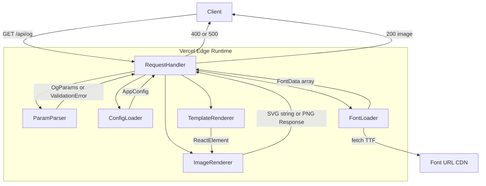
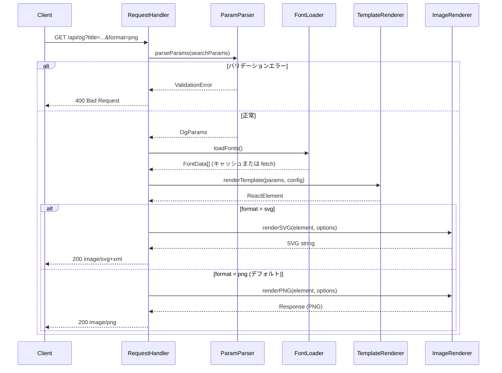
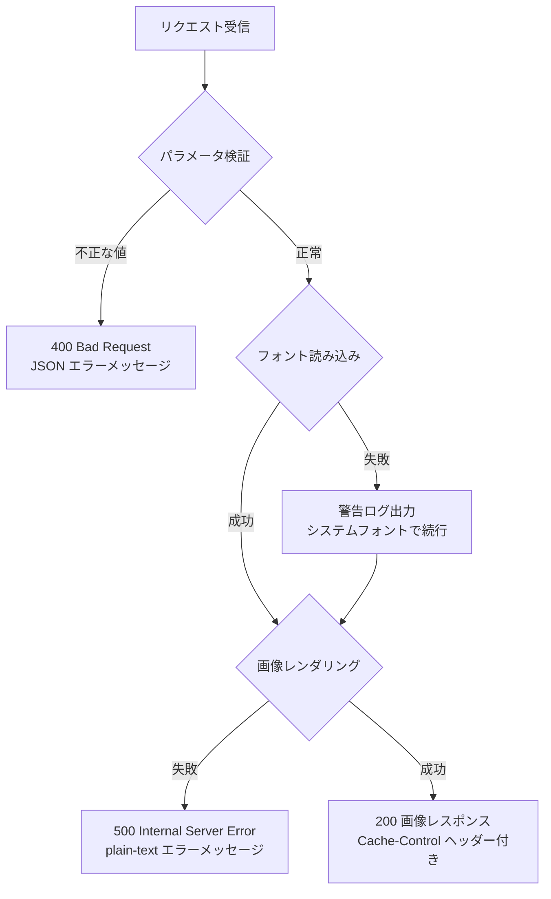

# 技術設計書

## Overview

OGP Image Service は、`yu9824's Notes` 技術ブログ向けに OGP 画像（SVG / PNG）を動的生成して配信するサービスである。URLクエリパラメータでタイトルや寸法を受け取り、satori（HTML/CSS → SVG 変換ライブラリ）を用いて画像を生成し、Vercel Edge Runtime 上で高速かつ低コストで稼働する。

TypeScript で実装し、全ソースファイルに日本語コメントを付与することで、フォークによるカスタマイズを容易にする。GitHub Actions による CI（ユニットテスト・型チェック・脆弱性スキャン）と Dependabot による依存関係監視を備える。

### Goals

- `/api/og` エンドポイントで SVG と PNG の両形式を返す
- URLパラメータ（`title`・`width`・`height`・`textWidth`・`format`）で画像をカスタマイズ可能にする
- Vercel Edge Runtime 上でタイムアウト制限内に応答する
- 環境変数による設定の外部化でフォーク・移植を容易にする
- GitHub Actions CI と Dependabot で継続的な品質・セキュリティ監視を確立する

### Non-Goals

- 認証・アクセス制御（Public API として設計）
- レート制限の実装（Vercel CDN キャッシュと文字数上限による間接的な抑制のみ）
- 複数テンプレートの切り替え
- クライアントサイド UI（フロントエンドページは不要）

---

## Requirements Traceability

| 要件 | 概要 | コンポーネント | インターフェース | フロー |
|------|------|--------------|----------------|--------|
| 1.1 | GET /api/og エンドポイント | RequestHandler | API Contract | リクエスト処理フロー |
| 1.2 | SVG/PNG の Content-Type 返却 | RequestHandler, ImageRenderer | API Contract | リクエスト処理フロー |
| 1.3 | デフォルト PNG 返却 | ParamParser | `OgParams.format` | — |
| 1.4 | Cache-Control ヘッダー設定 | RequestHandler | API Contract | — |
| 1.5 | 500 エラー返却（レンダリング失敗時） | RequestHandler | API Contract | エラーハンドリングフロー |
| 2.1 | title テキスト描画 | TemplateRenderer | `OgParams.title` | — |
| 2.2 | title 省略時は空タイトルで描画 | ParamParser, TemplateRenderer | `OgParams.title` | — |
| 2.3–2.5 | width / height パラメータ処理 | ParamParser | `OgParams` | — |
| 2.6–2.7 | textWidth パラメータ処理 | ParamParser | `OgParams` | — |
| 2.8 | 数値パラメータ不正時 400 | ParamParser | `ValidationError` | エラーハンドリングフロー |
| 2.9–2.10 | format パラメータ処理・不正時 400 | ParamParser | `ValidationError` | エラーハンドリングフロー |
| 2.11 | title 200 文字超過時 400 | ParamParser | `ValidationError` | エラーハンドリングフロー |
| 2.12 | 未定義パラメータの無視 | ParamParser | — | — |
| 3.1–3.5 | OGP テンプレートデザイン | TemplateRenderer | `RenderInput` | — |
| 3.6 | 日本語・英語フォント描画 | FontLoader | `FontData` | — |
| 4.1 | Vercel Function として動作 | RequestHandler | — | — |
| 4.2 | タイムアウト内応答 | ImageRenderer, FontLoader | — | — |
| 4.3 | Edge Runtime 対応 | 全コンポーネント | — | — |
| 4.4 | ファイルシステム非依存 | FontLoader | — | — |
| 4.5 | フォントフォールバック | FontLoader | `FontLoadResult` | エラーハンドリングフロー |
| 4.6 | Node.js 24.x エンジン指定 | package.json | — | — |
| 5.1–5.7 | GitHub リポジトリ公開ファイル群（MIT LICENSE 含む） | —（非コンポーネント） | — | — |
| 5.8 | OFL ライセンス文書同梱（`public/fonts/OFL.txt`） | `public/fonts/`（静的アセット）| — | — |
| 5.9 | フォント帰属表示（NOTICE / README） | —（非コンポーネント）| — | — |
| 5.10 | サブセット生成時の著作権メタデータ保持 | `scripts/subset-fonts.sh` | — | — |
| 6.1–6.4 | 環境変数による設定外部化 | ConfigLoader | `AppConfig` | — |
| 6.5 | ローカル開発コマンド | package.json scripts | — | — |
| 6.6 | フォーク手順 README 記載 | — | — | — |
| 6.7 | サブセットフォント同梱 | `public/fonts/`（静的アセット）| — | — |
| 6.8 | サブセット生成スクリプト | `scripts/subset-fonts.sh` | — | — |
| 7.1 | TypeScript + 日本語コメント | 全ソースファイル | — | — |
| 7.2 | ユニットテスト | tests/ | — | — |
| 7.3–7.4 | GitHub Actions CI | .github/workflows/ci.yml | — | — |
| 7.5 | npm test スクリプト | package.json | — | — |
| 7.6 | CI Node.js 24.x | .github/workflows/ci.yml | — | — |
| 7.7 | npm audit | .github/workflows/ci.yml | — | — |
| 7.8–7.9 | Dependabot 設定 | .github/dependabot.yml | — | — |

---

## Architecture

### Architecture Pattern & Boundary Map

本サービスは **Layered Architecture（関心の分離）** を採用する。HTTP 層・ドメイン層・インフラ層を明確に分離することで、テンプレートやバリデーションのロジックをランタイムに依存せずテスト可能にする。



- **RequestHandler**: HTTP 層。入力受け取り・出力返却のみ担当。
- **ParamParser**: ドメイン層。バリデーションと OgParams への変換。副作用なし。
- **ConfigLoader**: インフラ層。環境変数読み取りと AppConfig 構築。
- **FontLoader**: インフラ層。フォントの fetch とモジュールスコープキャッシュ。
- **TemplateRenderer**: ドメイン層。純粋関数。OgParams → ReactElement 変換。
- **ImageRenderer**: インフラ層。satori / ImageResponse 呼び出し。

### Technology Stack

| Layer | Choice / Version | Role | Notes |
|-------|-----------------|------|-------|
| Runtime | Vercel Edge Runtime | HTTP リクエスト処理 | `export const runtime = 'edge'` |
| Framework | Next.js 15.x App Router | ルーティング、`next/og` 提供 | `app/api/og/route.ts` |
| Image Generation (PNG) | `next/og` ImageResponse | satori + resvg 統合 PNG 生成 | Next.js 組み込み |
| Image Generation (SVG) | `satori` ^0.10.x | SVG 文字列生成 | next/og と内部共有 |
| Language | TypeScript ^5.x | 型安全な実装 | `strict: true` |
| Test | Vitest ^2.x | ユニットテスト・型チェック | TypeScript ネイティブ対応 |
| Node.js | 24.x | ローカル開発・CI 実行 | Vercel Serverless フォールバック時も同一 |

詳細な技術選定根拠は `research.md` の Design Decisions セクションを参照。

---

## System Flows

### リクエスト処理フロー



### エラーハンドリングフロー



---

## Components and Interfaces

### コンポーネント概要

| Component | Layer | Intent | Req Coverage | Key Dependencies |
|-----------|-------|--------|--------------|-----------------|
| RequestHandler | HTTP | HTTP I/O、ルーティング | 1.1–1.5, 4.1–4.3 | ParamParser, FontLoader, TemplateRenderer, ImageRenderer (P0) |
| ParamParser | Domain | クエリパラメータ解析・バリデーション | 1.3, 2.1–2.12 | なし |
| ConfigLoader | Infrastructure | 環境変数読み取り、デフォルト値管理 | 6.1–6.4 | process.env |
| FontLoader | Infrastructure | フォント fetch とキャッシュ | 3.6, 4.4–4.5 | fetch API, ConfigLoader (P0) |
| TemplateRenderer | Domain | JSX テンプレート描画 | 3.1–3.5, 2.1–2.2 | React (P0) |
| ImageRenderer | Infrastructure | satori/ImageResponse 呼び出し | 1.2–1.3, 4.2 | satori, next/og (P0), FontLoader (P0) |

---

### HTTP 層

#### RequestHandler

| Field | Detail |
|-------|--------|
| Intent | HTTP リクエストを受け取り、各コンポーネントを呼び出して画像レスポンスを返す |
| Requirements | 1.1, 1.2, 1.3, 1.4, 1.5, 4.1, 4.2, 4.3 |

**Responsibilities & Constraints**
- `GET /api/og` のみを受け付ける（Next.js の route.ts の `GET` エクスポート）
- ParamParser の結果が ValidationError の場合は即座に 400 を返す
- レンダリング例外は全て catch して 500 を返す
- 正常応答には必ず `Cache-Control` ヘッダーを付与する
- `export const runtime = 'edge'` を宣言する

**Dependencies**
- Inbound: Client — HTTP GET リクエスト (P0)
- Outbound: ParamParser — パラメータ解析 (P0)
- Outbound: ConfigLoader — 設定取得 (P0)
- Outbound: FontLoader — フォントデータ取得 (P0)
- Outbound: TemplateRenderer — JSX 生成 (P0)
- Outbound: ImageRenderer — 画像生成 (P0)

**Contracts**: API [x]

##### API Contract

| Method | Path | Query Params | Response (正常) | Response (エラー) |
|--------|------|-------------|----------------|-------------------|
| GET | `/api/og` | 下記参照 | 200 `image/png` または `image/svg+xml` | 400 JSON / 500 text |

**クエリパラメータ定義**

| パラメータ | 型 | デフォルト | 制約 |
|------------|-----|----------|------|
| `title` | string | `''` | URL デコード後 200 文字以内 |
| `width` | 正の整数 | `1200` | 正の整数のみ |
| `height` | 正の整数 | `630` | 正の整数のみ |
| `textWidth` | 正の整数 | `width × 0.8` | 正の整数のみ |
| `format` | `'png'` \| `'svg'` | `'png'` | `png` または `svg` のみ |

**レスポンスヘッダー（正常時）**

```
Content-Type: image/png | image/svg+xml
Cache-Control: public, max-age=604800, stale-while-revalidate=86400
```

**エラーレスポンス形式**

- 400: `Content-Type: application/json` + `{ "error": "...", "field": "..." }`
- 500: `Content-Type: text/plain` + エラーメッセージ文字列

**Implementation Notes**
- Integration: `app/api/og/route.ts` に `export async function GET(request: Request)` として実装
- Validation: ParamParser の結果を判別し、`ok: false` の場合のみ 400 を返す
- Risks: Edge Runtime のバンドルサイズ制限（Hobby プラン 1 MB）。フォントを URL フェッチに限定し、バンドルに含めないことで回避

---

### ドメイン層

#### ParamParser

| Field | Detail |
|-------|--------|
| Intent | URLSearchParams を解析し、型安全な OgParams または ValidationError を返す純粋関数 |
| Requirements | 1.3, 2.1–2.12 |

**Responsibilities & Constraints**
- 副作用なし（純粋関数）
- 未知のパラメータは無視する（2.12）
- 1 つのパラメータが不正な場合は最初のエラーのみ返す（fail-fast）

**Contracts**: Service [x]

##### Service Interface

```typescript
/** クエリパラメータの解析結果 */
type ParseResult =
  | { ok: true; data: OgParams }
  | { ok: false; error: ValidationError };

/** 解析・検証済みのパラメータ */
interface OgParams {
  title: string;       // デフォルト: ''
  width: number;       // デフォルト: defaults.width
  height: number;      // デフォルト: defaults.height
  textWidth: number;   // デフォルト: width * defaults.textWidthRatio
  format: 'png' | 'svg'; // デフォルト: 'png'
}

/** バリデーションエラー情報 */
interface ValidationError {
  code: 'INVALID_FORMAT' | 'INVALID_DIMENSION' | 'TITLE_TOO_LONG';
  message: string;
  field: string;
}

/**
 * parseParams に渡すデフォルト値。AppConfig から抽出した数値のみで
 * ドメイン層が AppConfig（インフラ層）に依存しないようにする
 */
interface ParamDefaults {
  width: number;           // AppConfig.defaultWidth
  height: number;          // AppConfig.defaultHeight
  textWidthRatio: number;  // AppConfig.defaultTextWidthRatio
}

/** URLSearchParams を OgParams または ValidationError に変換する */
function parseParams(
  searchParams: URLSearchParams,
  defaults: ParamDefaults
): ParseResult;
```

- Preconditions: `searchParams` は有効な URLSearchParams オブジェクトであること
- Postconditions: `ok: true` の場合、全フィールドは型定義の制約を満たす
- Invariants: 未知のパラメータキーは常に無視される

**Implementation Notes**
- Validation: `width`・`height`・`textWidth` は `Number.isInteger(n) && n > 0` で検証
- Validation: `title` は URL デコード後の文字数で 200 文字以内かを検証
- Validation: `format` は `'png'` または `'svg'` のみ許可
- 責務分離: `RequestHandler` が `loadConfig()` で得た `AppConfig` から `ParamDefaults` を抽出して渡す。これにより `ParamParser` は `AppConfig` の型構造を知らずに済む

---

#### TemplateRenderer

| Field | Detail |
|-------|--------|
| Intent | OgParams と AppConfig を受け取り、satori に渡す ReactElement を返す純粋関数 |
| Requirements | 3.1, 3.2, 3.3, 3.4, 3.5, 2.1, 2.2 |

**Responsibilities & Constraints**
- 副作用なし（純粋関数）
- `useState`・`useEffect` は使用不可（satori 制約）
- `calc()` は使用不可（satori 制約）
- 3 行超過時は `…` で省略する（3.4）
- `textWidth` で折り返し制御する（3.3）

**Contracts**: Service [x]

##### Service Interface

```typescript
/** テンプレートへの入力 */
interface RenderInput {
  params: OgParams;
  config: AppConfig;
}

/** OgParams と AppConfig から satori 用 ReactElement を生成する */
function renderTemplate(input: RenderInput): React.ReactElement;
```

- Preconditions: `input.params` は parseParams で検証済みであること
- Postconditions: 返値は satori が受け付ける純粋 JSX 要素
- Invariants: 同一の `input` に対して常に同一の出力を返す（参照透過性）

**Implementation Notes**
- Integration: `lib/template.tsx` に実装。satori の CSS 制約（Flexbox のみ、`calc()` 不可）に従う
- テキスト折り返し: `style={{ width: textWidth, wordBreak: 'break-all' }}` で制御
- 3 行省略: `style={{ display: '-webkit-box', WebkitLineClamp: 3, WebkitBoxOrient: 'vertical', overflow: 'hidden' }}` で制御。**`-webkit-line-clamp` は satori で部分サポートのため、実装時に動作確認が必須**。動作しない場合のフォールバックとして「`title` を文字数でスライスして `'…'` を付与する手動省略」を実装することを推奨（200 文字上限があるため上限の文字列長でスライスすれば実用上問題ない）

**テンプレートのファイル構造とカスタマイズ方針**

フォークユーザーが最小限の変更でデザインをカスタマイズできるよう、`lib/template.tsx` はファイル先頭に「デザイントークン」ブロックを集約する。

```
lib/template.tsx
├── ── DESIGN TOKENS ──────────────────────────────
│   │  // ★ カスタマイズはここだけ変更すればOK
│   ├── BACKGROUND_COLOR: string     // 背景色（例: '#0f172a'）
│   ├── TEXT_COLOR: string           // 本文・タイトル色（例: '#f1f5f9'）
│   ├── ACCENT_COLOR: string         // アクセント色（例: '#38bdf8'）
│   ├── TITLE_FONT_SIZE: number      // タイトルの基準フォントサイズ（px）
│   ├── LABEL_FONT_SIZE: number      // ブログ名ラベルのフォントサイズ（px）
│   └── PADDING: number             // 外周の余白（px）
└── ── renderTemplate() ────────────────────────────
    └── JSX テンプレート本体（トークンを参照）
```

- デザイントークンはファイル冒頭の `const` として定義し、日本語コメントで各項目の役割を説明する
- JSX 本体ではトークン定数のみを参照し、カラーコードや数値リテラルを直接埋め込まない
- これにより、フォークユーザーはデザイントークンブロック（10〜15 行程度）を変更するだけでブランドカラーや文字サイズを変更できる
- レイアウト構造（Flexbox の組み方）を変更したい場合は JSX 本体を直接編集する

---

### インフラ層

#### ConfigLoader

| Field | Detail |
|-------|--------|
| Intent | 環境変数を読み取り、フォールバック付きの AppConfig を返す |
| Requirements | 6.1, 6.2, 6.3, 6.4 |

**Contracts**: Service [x]

##### Service Interface

```typescript
/** アプリケーション設定 */
interface AppConfig {
  siteName: string;              // env: SITE_NAME, default: "yu9824's Notes"
  baseUrl: string;               // env: NEXT_PUBLIC_BASE_URL → VERCEL_URL → 'http://localhost:3000' の順でフォールバック。フォント URL の絶対 URL 化に使用
  fontUrlRegular: string;        // env: FONT_URL_REGULAR, default: '{baseUrl}/fonts/NotoSansJP-Regular.otf'（同梱サブセット）
  fontUrlBold: string;           // env: FONT_URL_BOLD,    default: '{baseUrl}/fonts/NotoSansJP-Bold.otf'（同梱サブセット）
  fontFetchTimeoutMs: number;    // env: FONT_FETCH_TIMEOUT_MS, default: 5000
  defaultWidth: number;          // env: DEFAULT_WIDTH, default: 1200
  defaultHeight: number;         // env: DEFAULT_HEIGHT, default: 630
  defaultTextWidthRatio: number; // env: DEFAULT_TEXT_WIDTH_RATIO, default: 0.8
}

/** 環境変数を読み取り AppConfig を返す。不正な値はログ警告を出してデフォルト値を使用する */
function loadConfig(): AppConfig;
```

- Postconditions: 全フィールドは有効な型を持つ（不正な env 値はデフォルト値で上書き）

**Implementation Notes**
- Validation: 数値型 env は `Number.isFinite()` で検証。不正な場合は `console.warn` でログ出力し、デフォルト値を使用（4.6）
- `baseUrl` の解決順序: `NEXT_PUBLIC_BASE_URL`（Vercel が自動付与）→ `VERCEL_URL`（プレビュー環境）→ `'http://localhost:3000'`（ローカル開発）の順でフォールバック。`VERCEL_URL` は `https://` プレフィックスを持たないため `https://` を付与すること
- `fontUrlRegular` / `fontUrlBold` の env 変数が指定された場合はそのまま使用し、未指定の場合は `baseUrl` を使って絶対 URL を構築する
- デフォルトフォント: Noto Sans JP を同梱サブセットとして提供。Regular と Bold の 2 ウェイトを用意することで本文とタイトルの視覚的差別化を図る

---

#### FontLoader

| Field | Detail |
|-------|--------|
| Intent | satori 用フォントデータを URL からフェッチし、モジュールスコープでキャッシュする |
| Requirements | 3.6, 4.4, 4.5 |

**Contracts**: Service [x]

##### Service Interface

```typescript
/** satori fonts オプションに渡すフォントデータ */
interface FontData {
  name: string;
  data: ArrayBuffer;
  weight: 400 | 700;
  style: 'normal';
}

/** フォント読み込み結果 */
type FontLoadResult =
  | { ok: true; fonts: FontData[] }
  | { ok: false; fonts: []; warning: string };

/** フォントデータをフェッチ（またはキャッシュから返す）する */
function loadFonts(config: AppConfig): Promise<FontLoadResult>;
```

- Postconditions: `ok: true` の場合、`fonts` は Regular + Bold の 2 件の有効な FontData を含む
- Postconditions: `ok: false` の場合、`fonts` は空配列。`warning` にエラー内容を含む

**Implementation Notes**

**フォントフォールバック時の動作仕様（重要）**

Vercel Edge Runtime は V8 Isolate 上で動作するため **システムフォントが存在しない**。`fonts: []` を satori/ImageResponse に渡した場合の実際の動作は以下のとおり：

| 文字種 | フォールバック時の表示 |
|--------|----------------------|
| ASCII (英数字・記号) | satori 内蔵フォントで描画される（文字化けなし）|
| ひらがな・カタカナ・漢字 | **豆腐（□）になる**。satori に日本語フォールバックフォントはない |

したがって「フォールバック継続」の意味は **「日本語が表示されなくても 200 画像を返してサービスを止めない」** であり、日本語タイトルが正しく表示されることは保証しない。要件 4.5 の「fall back to a system font」はこの制約を明示的に受け入れた上での仕様とする。

- デフォルト構成（`/public/fonts/` 同梱サブセット）ではコールドスタート時も同一オリジンへの fetch のため、フォント取得失敗のリスクは極めて低い
- CDN 差し替え時（`FONT_URL_REGULAR` / `FONT_URL_BOLD` 設定時）は CDN 障害でフォールバックに入る可能性があり、その際は日本語が□になることを運用者は承知しておく必要がある

**高速化・安定化のための設計方針**

| 工夫 | 実装方法 | 効果 |
|------|---------|------|
| モジュールスコープキャッシュ | `let cache: Promise<FontLoadResult> \| null = null` をモジュール変数として保持し、初回フェッチ後は同じ Promise を返す | ウォームリクエストでの再フェッチを完全回避。コールドスタート時のみネットワーク通信が発生 |
| Regular / Bold 並列フェッチ | `Promise.all([fetch(regularUrl), fetch(boldUrl)])` で同時取得 | 直列フェッチと比較してフォント読み込み時間を約 50% 削減 |
| フェッチタイムアウト | `AbortSignal.timeout(config.fontFetchTimeoutMs)` を fetch オプションに渡す（デフォルト 5000ms） | CDN 障害時にリクエスト全体が詰まるのを防止。タイムアウト後はフォールバックに遷移 |
| フォールバック継続 | フェッチ失敗・タイムアウト時は `ok: false` を返し、RequestHandler が空 fonts 配列で描画を続行（日本語は□）| フォント CDN 障害時もサービス停止を回避（4.5）|

**フォント配置戦略（デフォルト: 同梱サブセット）**

| 配置方法 | Edge バンドルへの影響 | 外部依存 | デフォルト採用 |
|----------|----------------------|---------|---------------|
| `/public/fonts/` に OTF 配置（サブセット済み） | なし（静的ファイルは別配信） | なし | **◎ 採用** |
| 外部 CDN から fetch（env var 指定時） | なし | CDN に依存 | 設定で差し替え可能 |
| JS バンドルに import | 超過（Hobby 上限 1 MB に対しフル字体は 8〜15 MB） | なし | ✗ 非採用 |

- **デフォルト**: `public/fonts/NotoSansJP-Regular.otf` と `public/fonts/NotoSansJP-Bold.otf` を同梱。FontLoader は `config.fontUrlRegular`（または `config.fontUrlBold`）を使用して絶対 URL で fetch する。デフォルト URL は `ConfigLoader` が `config.baseUrl` を使って `${baseUrl}/fonts/NotoSansJP-Regular.otf` のように構築する。Vercel は `/public` を自動で CDN 配信するため実質ゼロレイテンシ
- **サブセット対象文字**: ひらがな・カタカナ・常用漢字（2,136 字）・ASCII（95 字）。フル字体 8〜15 MB → サブセット後 500 KB〜1 MB 程度に削減
- **再生成スクリプト**: `scripts/subset-fonts.sh` で fonttools（`pyftsubset`）を使用してサブセットを生成。CI で自動実行する必要はなく、メンテナーが手動で実行してコミットする運用とする（6.8）
- **CDN への差し替え**: `FONT_URL_REGULAR` / `FONT_URL_BOLD` を設定すれば同梱フォントをバイパスして外部 URL を使用できる
- フォント形式: OTF を使用（satori は TTF / OTF / WOFF に対応。WOFF2 は非対応）
**OFL ライセンス遵守**

| 義務 | 対応 |
|------|------|
| OFL 本文の同梱 | `public/fonts/OFL.txt` としてリポジトリに配置（5.8）。Vercel が静的ファイルとして配信するが、ブラウザ URL で取得できる必要はない |
| 著作権表示の保持 | `pyftsubset` はデフォルトでフォントの name テーブルを維持するため、`--no-subset-tables+=name` を明示指定しないこと（5.10）|
| 帰属表示 | `NOTICE` ファイルまたは README に「Noto Sans JP © Google LLC and the Noto Authors, SIL OFL 1.1」を記載（5.9）|
| Reserved Font Name | Noto フォントは Google が RFN を設定していないため、サブセット後も "Noto Sans JP" の名称を維持可能 |

---

#### ImageRenderer

| Field | Detail |
|-------|--------|
| Intent | ReactElement を受け取り、SVG 文字列または PNG Response を返す |
| Requirements | 1.2, 1.3, 4.2, 4.3 |

**Contracts**: Service [x]

##### Service Interface

```typescript
/** SVG レンダリングオプション */
interface RenderOptions {
  width: number;
  height: number;
  fonts: FontData[];
}

/** SVG 文字列を生成する（format=svg 時に使用） */
function renderSVG(
  element: React.ReactElement,
  options: RenderOptions
): Promise<string>;

/** PNG Response を生成する（format=png 時に使用） */
function renderPNG(
  element: React.ReactElement,
  options: RenderOptions
): Response;
```

- Preconditions: `element` は satori 互換の純粋 JSX 要素であること
- Postconditions: `renderSVG` は有効な SVG 文字列を返す
- Postconditions: `renderPNG` は `Content-Type: image/png` を持つ `Response` を返す

**Implementation Notes**
- Integration: `renderSVG` は `satori()` を直接呼び出す。`renderPNG` は `next/og` の `ImageResponse` を使用
- ヘッダー再構築: `ImageResponse` が返す `Response` のヘッダーを上書きする際は、`Content-Type` を含む必要なヘッダーをすべて明示的に設定する。`ImageResponse.body` は ReadableStream のため、以下のように新しい `Response` を構築する
  ```typescript
  const imageResponse = new ImageResponse(element, { width, height, fonts });
  return new Response(imageResponse.body, {
    headers: {
      'Content-Type': 'image/png',
      'Cache-Control': 'public, max-age=604800, stale-while-revalidate=86400',
    },
  });
  ```
- SVG レスポンスも同様に `Content-Type: image/svg+xml` と `Cache-Control` を明示設定する（RequestHandler 側で付与）

---

## Data Models

### Domain Model

本サービスはデータベースを持たない。主要な値オブジェクトは以下の通り。

- **OgParams**: バリデーション済みリクエストパラメータ。`ParamParser` が生成し不変。
- **AppConfig**: 環境変数から構築した設定値。サービス起動時に 1 度生成。
- **FontData**: フォントバイナリと属性のペア。モジュールスコープにキャッシュ。
- **RenderInput**: TemplateRenderer への入力集約。OgParams + AppConfig。

### Data Contracts & Integration

**API レスポンス（SVG 形式）**

```
Content-Type: image/svg+xml
Cache-Control: public, max-age=604800, stale-while-revalidate=86400
Body: SVG 文字列（UTF-8）
```

**API レスポンス（PNG 形式）**

```
Content-Type: image/png
Cache-Control: public, max-age=604800, stale-while-revalidate=86400
Body: PNG バイナリ
```

**400 エラーレスポンス**

```typescript
// Content-Type: application/json
interface ErrorResponse {
  error: string;   // ユーザー向けエラーメッセージ
  field: string;   // エラーのあったパラメータ名
}
```

---

## Error Handling

### Error Strategy

「Fail Fast」戦略を採用する。バリデーションは ParamParser で完結させ、ドメイン層以降ではエラーが発生しない前提でロジックを組む。インフラ層（フォント取得・レンダリング）の失敗のみ try/catch で補足する。

### Error Categories and Responses

**User Errors（4xx）**

| ケース | コード | メッセージ例 |
|--------|--------|------------|
| `title` 200 文字超過 | 400 | `"title must be 200 characters or fewer"` |
| `width`/`height`/`textWidth` が正の整数でない | 400 | `"width must be a positive integer"` |
| `format` が `svg`/`png` 以外 | 400 | `"format must be 'png' or 'svg'"` |

**System Errors（5xx）**

| ケース | 応答 | 備考 |
|--------|------|------|
| レンダリング例外 | 500 plain-text | エラーメッセージをそのまま返す |
| フォント取得失敗 | 200 画像（警告ログ） | システムフォントでフォールバック（4.5）|

### Monitoring

- フォント取得失敗: `console.warn('[FontLoader] フォント読み込み失敗:', error)` を出力（Vercel Functions ログで確認可能）
- レンダリング例外: `console.error('[ImageRenderer] 描画エラー:', error)` を出力

---

## Testing Strategy

### Unit Tests（Vitest）

対象はランタイム依存のない純粋関数・バリデーションロジックに絞る。

- **ParamParser**: `title` 200 文字制限、`width`/`height`/`textWidth` の正の整数バリデーション、`format` の不正値（`jpg` 等）、未知パラメータの無視、`title` 省略時のデフォルト空文字
- **ConfigLoader**: 有効な環境変数の読み取り、不正な数値型 env のデフォルト値フォールバックと警告ログ出力
- **TemplateRenderer**: 同一入力に対して同一の JSX 構造を返すこと（スナップショット的確認）

**Vitest 設定上の注意 — JSX Transform**

`lib/template.tsx` は JSX を含むため、`vitest.config.ts` に `@vitejs/plugin-react`（または `@vitejs/plugin-react-swc`）を組み込まないとコンパイルエラーになる。

```typescript
// vitest.config.ts
import react from '@vitejs/plugin-react';
import { defineConfig } from 'vitest/config';

export default defineConfig({
  plugins: [react()],
  test: {
    environment: 'node',
  },
});
```

- `TemplateRenderer` の単体テスト（task 8.3）は上記設定が必須。
- `ParamParser` / `ConfigLoader` のテストは JSX 非依存だが、同一 config ファイルで統一管理する。

### Integration Tests（省略）

Vercel Edge Runtime の実環境テストは `vercel dev` でのローカル確認に委ねる。

---

## Security Considerations

- **入力サニタイズ**: `title` は 200 文字上限で DoS 軽減。satori はテキストとして描画するため XSS は発生しない。
- **シークレット管理**: 環境変数（`SITE_NAME`・`FONT_URL` 等）は Vercel の環境変数設定に保存。`.env.example` に実値を含めない（5.5、5.6）。
- **依存関係監視**: Dependabot による週次更新 PR + `npm audit --audit-level=high` による CI スキャン（7.7、7.8）。

---

## Performance & Scalability

- **キャッシュ**: `Cache-Control: public, max-age=604800` により同一 URL の画像は Vercel CDN でキャッシュされる（1 週間）。
- **フォントキャッシュ**: `FontLoader` がモジュールスコープで `Promise` を保持するため、ウォームリクエスト時のフォント再フェッチを回避できる。
- **Edge Runtime**: コールドスタートが速く、コストが低い。

---

## Supporting References

詳細な技術比較・調査ログは `.kiro/specs/ogp-image-generator/research.md` を参照。
