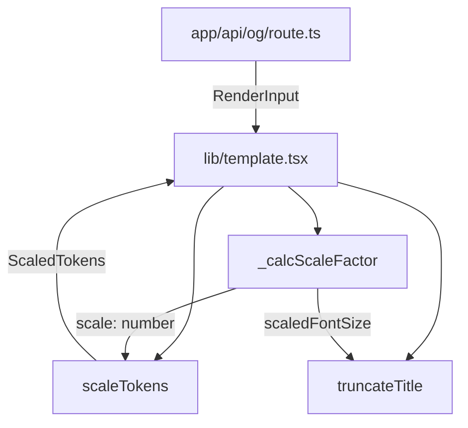

# Design Document: responsive-template

## Overview

本フィーチャーは `lib/template.tsx` のデザイントークン（フォントサイズ・余白・アクセントライン寸法）を固定値から動的スケーリング値へ移行し、400×210〜1200×630 などあらゆる画像サイズで視覚的に整合した OGP 画像を生成できるようにする。

**Purpose**: 任意の画像サイズリクエストに対して、デザインが崩れない OGP 画像をブログ運営者に提供する。
**Users**: OGP 画像を `<meta property="og:image">` に埋め込むブログ運営者。
**Impact**: `lib/template.tsx` 内部のトークン計算ロジックを変更するが、`renderTemplate` の公開シグネチャおよび `OgParams`・`AppConfig` の型定義は変更しない。

### Goals

- `min(width, height)` を基準としたスケール係数でデザイントークンを自動調整する
- `TITLE_FONT_SIZE` は 16px 以上、`LABEL_FONT_SIZE` は 12px 以上を保証して視認性を確保する
- 基準サイズ（1200×630）でスケール係数 1.0 を維持し、後方互換を確保する
- スケール係数算出ロジックを Vitest でユニットテスト可能な純粋関数として公開する

### Non-Goals

- `OgParams`・`AppConfig`・`RenderInput` 型定義の変更
- `renderTemplate` の関数シグネチャ変更
- 色トークン（`BACKGROUND_COLOR`・`TEXT_COLOR`・`ACCENT_COLOR`）のスケーリング
- `lib/` 以外のモジュール（`app/api/og/route.ts` 等）への変更
- レイアウト構造（Flex 方向・要素順序）の変更

## Architecture

### Existing Architecture Analysis

`lib/template.tsx` はモジュールスコープの定数（`TITLE_FONT_SIZE = 56` 等）と 2 つの関数（`renderTemplate`・`truncateTitle`）で構成される。現行の `truncateTitle` はモジュール定数 `TITLE_FONT_SIZE` をクロージャで参照しており、スケーリング後の値を渡せない。詳細は [research.md](research.md) を参照。

### Architecture Pattern & Boundary Map

変更は `lib/template.tsx` 単体に閉じる。新規の外部依存なし。



- **Selected pattern**: 純粋関数の分解（関数内関数 → 名前付きヘルパー）
- **Existing patterns preserved**: `renderTemplate` シグネチャ、`RenderInput` 型、`_` プレフィックスによるテスト公開関数
- **New components rationale**: `_calcScaleFactor` のみ新規追加（テスト要件 5.1 対応）
- **Steering compliance**: 副作用なし・参照透過性・`lib/` のモジュール単一責務を維持

### Technology Stack

| Layer | Choice / Version | Role in Feature | Notes |
|-------|-----------------|-----------------|-------|
| Language | TypeScript (strict) | 型安全なスケーリングロジック | `any` 禁止、新規型 `ScaledTokens` を追加 |
| Testing | Vitest 4 | `_calcScaleFactor` のユニットテスト | 新規テストケースを追加 |
| Rendering | satori (existing) | 変更なし | CSS calc() 非対応のため純粋数値計算が必要 |

## Requirements Traceability

| Requirement | Summary | Component | Interface | Notes |
|-------------|---------|-----------|-----------|-------|
| 1.1 | スケール係数を算出してトークンに乗算 | Template Renderer | `_calcScaleFactor`, `scaleTokens` | |
| 1.2 | `min(width, height)` を基準値として使用 | Template Renderer | `_calcScaleFactor` | |
| 1.3 | 各トークンに下限値を設ける | Template Renderer | `scaleTokens` | |
| 1.4 | `TITLE_FONT_SIZE` >= 16px | Template Renderer | `scaleTokens` | |
| 1.5 | `LABEL_FONT_SIZE` >= 12px | Template Renderer | `scaleTokens` | |
| 1.6 | 400×210 で PADDING が 64px 未満 | Template Renderer | `scaleTokens` | テストで検証 |
| 1.7 | 1200×630 でスケール = 1.0 | Template Renderer | `_calcScaleFactor` | |
| 2.1 | `truncateTitle` のフォントサイズをスケール後に連動 | Template Renderer | `truncateTitle` シグネチャ変更 | |
| 2.2 | スケール後 `TITLE_FONT_SIZE` >= 16px（ゼロ除算防止） | Template Renderer | `scaleTokens` | 1.4 と共有 |
| 2.3 | `textWidth <= 0` 時のクランプ | Template Renderer | `truncateTitle` | |
| 3.1 | 16:9 で重複なし | Template Renderer | `renderTemplate` JSX | PADDING クランプで保証 |
| 3.2 | 1:1 で重複なし | Template Renderer | `renderTemplate` JSX | PADDING クランプで保証 |
| 3.3 | PADDING * 2 <= width * 0.5 | Template Renderer | `scaleTokens` | |
| 3.4 | PADDING * 2 <= height * 0.5 | Template Renderer | `scaleTokens` | |
| 4.1 | `renderTemplate` シグネチャ不変 | Template Renderer | `renderTemplate` | |
| 4.2 | `OgParams`・`AppConfig` 型不変 | Template Renderer | 型定義参照のみ | |
| 4.3 | デフォルトサイズでスケール = 1.0 | Template Renderer | `_calcScaleFactor` | 1.7 と同一 |
| 5.1 | スケール関数を `export` | Template Renderer | `_calcScaleFactor` | |
| 5.2 | 400×210 → scale ≈ 0.333 | Template Renderer | `_calcScaleFactor` | |
| 5.3 | 630×630 → scale = 1.0 | Template Renderer | `_calcScaleFactor` | |

## Components and Interfaces

### Domain: Template Rendering (`lib/template.tsx`)

| Component | Domain | Intent | Req Coverage | Key Dependencies | Contracts |
|-----------|--------|--------|--------------|-----------------|-----------|
| `_calcScaleFactor` | Template Renderer | 短辺比からスケール係数を算出する純粋関数 | 1.1, 1.2, 1.7, 4.3, 5.1–5.3 | なし | Service |
| `scaleTokens` | Template Renderer | スケール係数を各デザイントークンに適用しクランプする | 1.1, 1.3–1.5, 2.2, 3.3, 3.4 | `_calcScaleFactor` | Service |
| `truncateTitle` | Template Renderer | スケール済みフォントサイズで文字数上限を再計算してタイトルを省略 | 2.1, 2.3 | `scaleTokens` の出力値 | Service |
| `renderTemplate` | Template Renderer | スケール済みトークンで JSX を構築する（シグネチャ不変） | 1.1, 3.1, 3.2, 4.1, 4.2 | `_calcScaleFactor`, `scaleTokens`, `truncateTitle` | Service |

---

#### `_calcScaleFactor`

| Field | Detail |
|-------|--------|
| Intent | `min(width, height) / min(BASE_WIDTH, BASE_HEIGHT)` でスケール係数を返す純粋関数 |
| Requirements | 1.1, 1.2, 1.7, 4.3, 5.1, 5.2, 5.3 |

**Responsibilities & Constraints**
- 基準解像度 `BASE_WIDTH = 1200`、`BASE_HEIGHT = 630` に対する短辺比を算出する
- 入力 `width`、`height` は呼び出し元（`renderTemplate`）が `OgParams` から取得した正の整数であることを前提とする（バリデーション済み）

**Dependencies**
- Inbound: `renderTemplate` — `OgParams.width`、`OgParams.height` を渡す (P0)
- Outbound: なし
- External: なし

**Contracts**: Service [x]

##### Service Interface
```typescript
/** テスト用に公開されたスケール係数算出関数（`_` プレフィックスはテスト専用を示す） */
export function _calcScaleFactor(width: number, height: number): number;
```
- Preconditions: `width > 0`、`height > 0`（`parseParams` により保証済み）
- Postconditions: `min(width, height) / 630` を返す（基準短辺 = 630）
- Invariants: 戻り値 > 0

**Implementation Notes**
- `min(1200, 630) = 630` が基準短辺。定数 `BASE_SHORT_SIDE = 630` としてモジュールスコープに定義する
- satori は `calc()` 非対応のため、係数は数値として計算してから JSX に渡す

---

#### `scaleTokens`（モジュール内部ヘルパー）

| Field | Detail |
|-------|--------|
| Intent | スケール係数を受け取り、クランプ済みの `ScaledTokens` を返す純粋関数 |
| Requirements | 1.1, 1.3, 1.4, 1.5, 2.2, 3.3, 3.4 |

**Responsibilities & Constraints**
- 各トークンに `scale` を乗算し、最小値クランプと PADDING 上限クランプを適用する
- PADDING は `Math.min(PADDING * scale, width * 0.25, height * 0.25)` でクランプする（左右合計・上下合計が各辺の 50% 以内）

**Dependencies**
- Inbound: `renderTemplate` — `scale`、`width`、`height` を渡す (P0)
- Outbound: なし
- External: なし

**Contracts**: Service [x]

##### Service Interface
```typescript
interface ScaledTokens {
  padding: number;
  titleFontSize: number;
  labelFontSize: number;
  accentLineHeight: number;
  accentLineWidth: number;
}

function scaleTokens(scale: number, width: number, height: number): ScaledTokens;
```

- Preconditions: `scale > 0`、`width > 0`、`height > 0`
- Postconditions:
  - `padding * 2 <= width * 0.5` かつ `padding * 2 <= height * 0.5`
  - `titleFontSize >= 16`
  - `labelFontSize >= 12`
  - `accentLineHeight >= 1`
  - `accentLineWidth >= 4`
- Invariants: 全フィールドが正の整数

**Implementation Notes**
- クランプ値の一覧（参考値）:

  | Token | Base | Min |
  |-------|------|-----|
  | `padding` | 64 | `max(1, min(64 * scale, width * 0.25, height * 0.25))` |
  | `titleFontSize` | 56 | 16 |
  | `labelFontSize` | 28 | 12 |
  | `accentLineHeight` | 4 | 1 |
  | `accentLineWidth` | 48 | 4 |

- リスク: `scaleTokens` はモジュール内部のため非 export。必要であれば将来的に `_scaleTokens` として公開可能。

---

#### `truncateTitle`（シグネチャ変更）

| Field | Detail |
|-------|--------|
| Intent | スケール済みフォントサイズで 1 行あたり文字数を計算し、3 行超を省略する |
| Requirements | 2.1, 2.3 |

**Responsibilities & Constraints**
- 第 3 引数 `fontSize` を追加し、モジュール定数 `TITLE_FONT_SIZE` への依存を除去する
- `textWidth <= 0` の場合は空文字を返す

**Dependencies**
- Inbound: `renderTemplate` — `title`、`textWidth`、`scaledTitleFontSize` を渡す (P0)

**Contracts**: Service [x]

##### Service Interface
```typescript
function truncateTitle(title: string, textWidth: number, fontSize: number): string;
```
- Preconditions: `fontSize >= 16`（`scaleTokens` のクランプにより保証）
- Postconditions: 戻り値の長さ <= `Math.floor(textWidth / fontSize) * 3`（+ 省略記号 1 文字）
- Invariants: `textWidth <= 0` のとき空文字を返す

---

#### `renderTemplate`（シグネチャ不変）

| Field | Detail |
|-------|--------|
| Intent | `_calcScaleFactor` → `scaleTokens` → `truncateTitle` を順に呼び出し、satori 用 JSX を返す |
| Requirements | 1.1, 3.1, 3.2, 4.1, 4.2 |

**Responsibilities & Constraints**
- `RenderInput` から `width`・`height` を取り出して `_calcScaleFactor` に渡す
- `scaleTokens` の結果を JSX の `style` プロパティに直接適用する
- 色トークン（`BACKGROUND_COLOR`・`TEXT_COLOR`・`ACCENT_COLOR`）はスケーリング対象外

**Contracts**: Service [x]

##### Service Interface
```typescript
export function renderTemplate(input: RenderInput): React.ReactElement;
```
- Preconditions: `input.params` が `parseParams` でバリデーション済みであること
- Postconditions: `input` が同一なら常に同一の JSX 構造を返す（参照透過性）

## Error Handling

### Error Strategy

デザイントークンのスケーリング処理はすべて純粋な数値計算であり、例外を発生させない。防御的クランプで境界値を保証する。

### Error Categories and Responses

| 状況 | 対応 | 実現箇所 |
|------|------|---------|
| `width` または `height` が 0 以下 | `parseParams` が `INVALID_DIMENSION` エラーを返すため `renderTemplate` には到達しない | `lib/params.ts`（既存） |
| スケール後 `padding` が `width * 0.25` を超過 | `Math.min` クランプで上限に切り詰め | `scaleTokens` |
| スケール後 `titleFontSize` が 16px 未満 | `Math.max(value, 16)` で下限保証 | `scaleTokens` |
| `textWidth <= 0` | `truncateTitle` が空文字を返す | `truncateTitle` |

### Monitoring

既存の `console.warn` パターン（`lib/config.ts` 参照）に従い、異常なスケール係数が算出された場合（例: `width` や `height` が極端に大きい）でも警告は不要。クランプで安全に処理される。

## Testing Strategy

### Unit Tests（新規追加）

1. `_calcScaleFactor(400, 210)` ≈ `0.333`（要件 5.2）
2. `_calcScaleFactor(630, 630)` === `1.0`（要件 5.3）
3. `_calcScaleFactor(1200, 630)` === `1.0`（要件 1.7 / 4.3）
4. `scaleTokens(0.333, 400, 210).titleFontSize` >= 16（要件 1.4）
5. `scaleTokens(0.333, 400, 210).padding` < 64 かつ <= `400 * 0.25`（要件 1.6 / 3.3）

### Snapshot Tests（更新）

- 既存スナップショット 5 件を再生成（`npm test -- --update-snapshots`）
- 新規スナップショット: `width=400, height=210` での `renderTemplate` 出力
- 新規スナップショット: `width=630, height=630` での `renderTemplate` 出力

### Regression

- `width=1200, height=630`（デフォルト）でスナップショットが従来と同等であることを確認（要件 4.3）。スナップショット再生成後の目視確認が必要。
